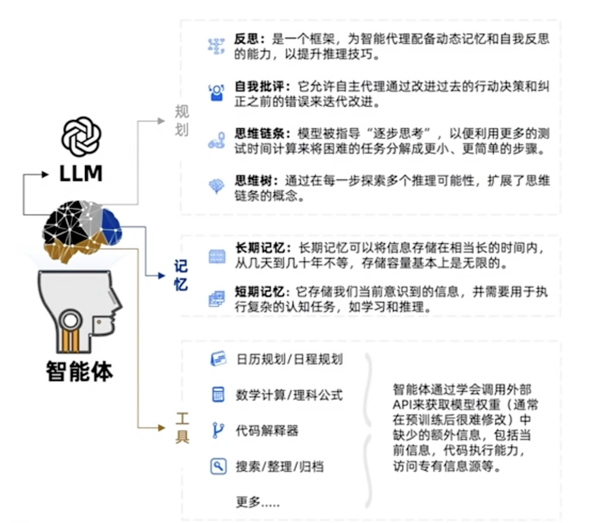

## 1、LLM发展事件线

在过去数十年间与`大语言模型（Large Language Model）`最相关的有6篇论文：

+ [Tomas Mikolov etc.  - Efficient Estimation of Word Representations in Vector Space(2013)](https://arxiv.org/abs/1301.3781)：CBOW（连续词袋模型）起源

+ [Ashish Vasvani etc.  - Attention is all your need(2017)](https://arxiv.org/abs/1706.03762)：Transformer是LLM核心的原子网络
+ [Jacob Devlin etc. - BERT: Pre-training of Deep Bidirectional Transformers for Language Understanding(2018)](https://arxiv.org/abs/1810.04805)：BERT证明了3.4B模型SSL（`Self-Supervised Learning, 自监督学习`）就有很好的效果
+ [Tom B. Brown etc. - Language Models are Few-Shot Learners(2020)](https://arxiv.org/abs/2005.14165)：GPT3打通了大模型的训练流程
+ [Jason Wei etc. - Finetuned Language Models Are Zero-Shot Learners(2021)](https://arxiv.org/abs/2109.01652)：Instruction Tuning将AI任务通用化
+ [Long Ouyang etc. - Training language models to follow instructions with human feedback(2022)](https://arxiv.org/abs/2203.02155)：InstructGPT打通RLHF（`Reinforcement Learning from Human Feedback，基于人类反馈的强化学习`），降低毒性

::: danger 待完成

阅读上述6篇论文，查阅相关资料并做解读整理。

:::

## 2、多智能体

::: tip 什么是智能体？

现在普遍认为：**智能体** = LLM + 记忆 + 规划 + 工具 + `神经` + `直觉`

:::



+ 关于`神经`和`直觉`的解释：

我们都知道一个人类不仅仅有大脑，还有用于接受真实世界信息的感觉器官（眼睛、耳朵、鼻子、舌头、皮肤），分别对应着视觉、听觉、嗅觉、味觉、触觉，人类正是通过这五感才能够与真实世界进行交互。人体的感觉器官通过**神经**与大脑相连，感觉器官收集来自环境的大量信息，神经借着电化学脉冲信号将信息传递给大脑，大脑依据传递进来的信息对周围世界作出判断。

以上是人类与真实世界交互的简单概述。而现在的`LLM`并不具备这样的**感觉神经系统**（`神经`），智能体所需要的`神经`并不仅仅是能够传递信息，其更需要的是性价比（低成本、低延时）。在这样的条件下，智能体更需要的是一种非常精确的神经实现，从而能够很好地应对现实世界中不同场景的不同任务。某种程度上可以将`神经`看作`LLM`所需要的一个可以应对不同任务的小模型（或许直接将`神经`集成在`LLM`中）。

事实上，大脑就好像是一个大型的预测机，通过接受传入的感官信息，结合已存储在大脑中的记忆和知识作出比较，然后预测接下来发生什么事情，从而以最佳方式处理当下的事件。如果预测失效，大脑就会更新自己的认知。这种大脑时刻准备着、基于经验和当下相匹配的思维模式其实是自动进行的，例如在某一时刻，你决定要做什么，这可能是你身体内的某一激素或那一时刻内心的某一想法所导致的。这种**自动的、潜意识的、迅速的**思维被称作是`直觉`，与之相反的是**缓慢的、有意识的、有逻辑的**`分析思维`。尽管分析思维在大多数情况下明显占据主导地位，但直觉往往与慢思考形成配合，发生在我们难以判断的意识背后。当下的`LLM`实际上多是在扩展同`分析思维`一样的相对长程的思维能力，缺少对`直觉`思维方式的建模。

::: tip 智能体之间如何协作？

**多智能体** = 智能体 + 环境 + SOP + 评审 + 路由 + 订阅 + 经济

:::

::: danger 待完成

多智能体的详细解释

:::

## 3、基本环境的安装和配置

+ 检查本机系统环境是否安装了`python 3.9+`：

  ```bash
  python --version
  ```

+ 获取MetaGPT（更多安装方式见[MetaGPT官方文档](https://docs.deepwisdom.ai/main/zh/guide/get_started/installation.html)）

  ```bash
  pip install metagpt # 获取稳定版MetaGPT 
  pip install -i https://pypi.tuna.tsinghua.edu.cn/simple metagpt==0.5.2 # 推荐
  ```

+ 配置MetaGPT（详细请查看[MetaGPT官方文档](https://docs.deepwisdom.ai/main/zh/guide/get_started/setup.html)）

+ 

  


