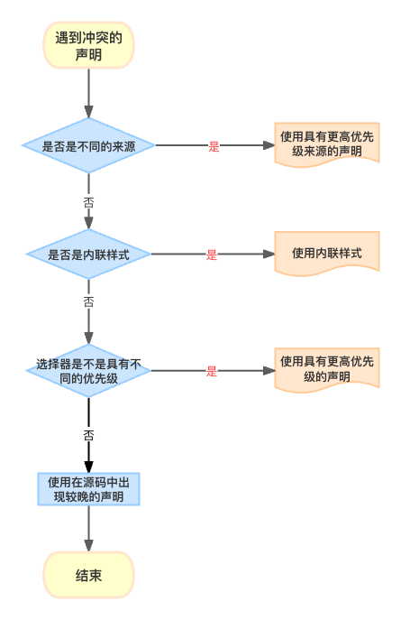
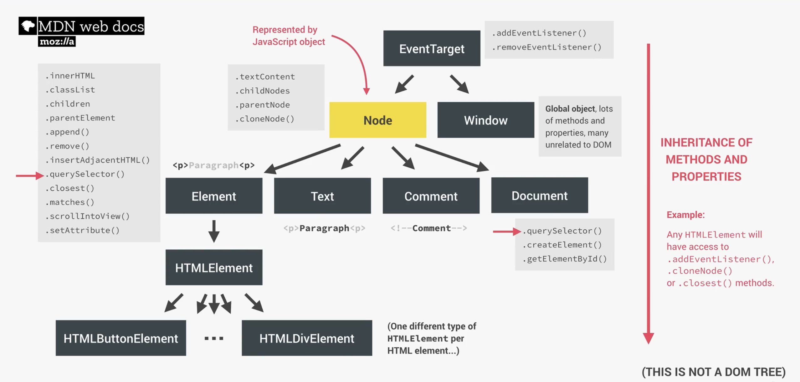

# CSS 核心原理

::: tip 阅读本文前置条件：

- 掌握 HTML、CSS 基础

:::

CSS核心原理主要包含三个基础话题：

+ 层叠
+ 单位
+ 盒模型

这三个基础话题讨论的内容是：**如何将特定样式应用到某一个具体元素**以及**如何确定元素的大小**。

## 1、当浏览器加载一个网页时背后发生了什么？

实际上在浏览器加载一个网页之前就发生了很多事情，比如**HTTP 请求、DNS 域名解析服务**等等，但在这里我们只讨论，浏览器加载一个网页时有关于`HTML`和 `CSS`的事情。

当浏览器加载`HTML文档`时，首先会对 HTML 文档进行解析，通过**逐行解析 HTML 文档**，浏览器会**构建所谓的文档对象模型**（`Document Object Model，DOM`）存储在内存中，`DOM `就好像是一个族谱树，它描述了整个`HTML`文档的结构，包括双亲、兄弟元素等等相关信息。事实上，在逐行解析 HTML 文档的过程中，浏览器除了构建 DOM 以外，它还会发现包含在`head`元素中的 CSS 样式表，并且就像遇到 HTML 文档一样，**CSS 样式表**也会被浏览器解析，在解析 CSS 的过程中，主要有两个阶段：

1. 通过一组被称为`cascade`（**层叠**）的规则解决冲突的 CSS 声明
2. 处理最终的 `css` 值（例如转换代码中边距值为相对值的百分比形式为具体的像素值），最终 CSS 被解析完成之后，浏览器也会构建出一个类似于 HTML DOM 的`CSS DOM`树模型存储在内存中。

当浏览器拥有了这两个模型之后，就会通过`visul formatting model`对网页进行渲染，最终被渲染完成的页面就会呈现在用户面前。

## 2、层叠、优先级

### 2.1、解决冲突的 CSS 声明

`css`作为声明式语言，严格来说并不能算作一门真正的计算机编程语言，却又要一定的抽象思维理才能更好地理解它，尽管不是设计工具 🛠️，但又需要想象力 🧠 才能做出好看的页面。写`css`代码本质上就是在**声明规则集**，如果某个元素具备这个类名，就应用这些样式，若是元素 a 的某个属性值为 x，则应用另外的样式。举例来说：

```css
/* 这是一个规则集 */
body {
  font-family: sans-serif; /* 这是一条声明 */
  padding: 20px; /* 声明由属性和值构成 */
}
```

::: info 相关术语解释

一个**规则集**（也可以称作**规则**）包含**选择器**和**声明块**两部分，选择器负责选取符合某些条件的元素，例如上面代码块中`body`这个元素选择器选择了`HTML`页面中的`body`元素；声明块负责声明被选择元素的样式，上面使用`{}`将所有**声明**包裹起来构成声明块；样式书写规则（也就是声明组成）由**属性**和**值**构成。

:::

而写`css`代码最重要的一点就是**需要以可预测的方式声明规则集**。要想做到可预测，首先就得理解`css`声明冲突是如何被解决的。举例来说：

::: code-group

```css [style.css]
.established {
  color: green;
}

p {
  color: red;
}
```

```html [index.html]
<p class="established">Est. 2020</p>
```

:::

> 上面`css`代码中使用两个不同的选择器（`类选择器`和`元素选择器`）选择了同一个`p`元素（也就是有多个规则集将被应用在`p`元素身上），并且两个规则集声明了同样的`color`属性样式（发生了声明冲突）；请问`p`元素最终会应用哪一个样式声明呢？

**层叠**是负责解决`css`声明冲突问题的一组规则，`Cascade`通过联合不同的样式表（例如开发人员编写的样式表、浏览器内置的样式表、用户可以通过更改自己设备字体大小等方式所拥有的样式声明）的方式，在多个冲突声明被应用于同一个 HTML 元素时，**处理冲突的 CSS 声明**。总的来说，层叠包含三种基本规则：

- **样式表的来源**：包括程序员写的样式、浏览器的默认样式、用户自定义的样式（比如用户设备上所设置的字体大小等等）
- **优先级**：哪个选择器具有更高的优先级
- **声明的顺序**：声明在源码中出现的先后次序



1. **样式表的来源**：浏览器（也被称作**用户代理**）加载`html`文档时会为某些元素设置默认的样式，例如`h1`元素字体大小，列表会有项目符号（前面的小点）等等，之后会加载程序员写的`css`样式表，如果程序员书写的某些样式和用户代理的默认样式发生冲突，那程序员书写的声明就会覆盖掉用户代理默认的声明。一般来说，**程序员书写的样式表优先级最高，接下来是用户自定义样式，优先级最低的是浏览器默认的样式声明**。而有一种例外情况：在声明之后添加`! improtant`关键字能够提升来源优先级。以下是不同来源优先级的重要性排序（**从上到下依次降低**）：

   ::: danger 样式表来源重要性排序

   - 用户的`! important`声明
   - 开发人员的`! important`声明
   - 开发人员的普通声明
   - 用户的普通声明
   - 用户代理的默认声明

   :::

2. **优先级**：事实上 99%的样式来源基本相同（即程序员所书写的样式表），当样式来源相同时，层叠便会依据优先级来解决声明冲突的问题。事实上浏览器将优先级分为**内联样式**和**选择器样式**两个部分。

   - 内联样式：也就是直接在`html`元素上通过`style`属性声明的样式，也被称作**行内样式**，行内样式是直接作用于具体的某一个元素，它的优先级要比选择器优先级高。除非使用`! important`关键字提高写在样式表中声明的来源优先级。

   - 选择器优先级：层叠通过数值表示对选择器进行标记，以此来表示选择器特异性（`specificity`）。选择器特异性按照`(inline、id、classes、elements)`的格式对声明进行优先级赋值，每当有一个符合的选择器，其对应位置就**加 1**。ID 选择器具有比类选择器更高的优先级，元素选择器具有最低的优先级。也就是说只有当 ID 选择器数量相同时，才会比较类选择器，依次类推；另外伪类选择器（比如`:hover`等）、属性选择器和类选择器位于同一级别。伪元素选择器（比如`::after`等）和元素选择器位于同一级别。而通用选择器（`*`）和组合器（`>`、`～`等）对优先级没有影响。举例来说：

     ```css
     .btn {
       color: white;
     }
     /* (0, 0, 1, 0) */
    
     nav#nav div.pull-right .btn {
       color: green;
     }
     /* (0, 1, 2, 2) */
    
     a {
       color: purple;
     }
     /* (0, 0, 0, 1) */
    
     #nav a.button:hover {
       color: yellow;
     }
     /* (0, 1, 2, 1) */
    
     * {
       color: black;
     }
     /* (0, 0, 0, 0) */
     ```

   * 以上最终生效的声明会是**第 2 个**。

   ::: danger 选择器优先级重要性排序：（**重要性依次降低**）

   - 内联样式
   - `id`选择器
   - 类选择器、伪类选择器、属性选择器
   - 元素选择器、伪元素选择器

   :::

   ::: info 一点经验之谈

   当你发现书写的某个声明并没有生效，大概率是被其他优先级更高的声明所覆盖了。虽然`! important`能够很方便的提升优先级，但这并不是最好的做法，尤其是在大型项目中你的`css`代码有非常非常多的时候。那更好的做法是什么呢？答案是**通过优先级规则解决优先级冲突问题**。通常最好让优先级尽可能低，当需要覆盖某些样式时，你的选择空间就会更大。

   :::

3. **声明的顺序**：当样式表的来源与优先级都相同时，解决 css 声明冲突问题的规则就是依据声明在样式表中出现的先后顺序。当声明在样式表中出现的位置**靠后**或者其所在的样式表被页面**较晚引入**，那么它就具有更高的优先级。
   
   - 经典的链接样式 lvha 口诀例子

::: tip 📢 提示

- 在面对一个待解决的样式问题时，可以遵循两个步骤进行解决，首先**确定可以实现所需效果的声明**。之后**思考可以选择什么样结构的选择器**，最后依据需求选择最符合的解决方案

- 尽管`! important`声明能够帮助你很容易的解决你所遇到的问题，但并不推荐遇到问题就直接使用`! important`，相反你应该搞清楚真正发生了什么，这会使你的代码具有更好的可维护性。

- 虽然内联样式拥有较高的优先级，但请不要随意使用内联样式，因为这会破坏你代码的扩展性。

- 尽量不要使用 ID 选择器，因为 ID 属性是唯一的，而它具有最高的优先级，当选择使用 ID 选择器，覆盖样式时的解决方案就会少很多。最好的做法是如同前面所说的那样，尽可能让自己有更多选择能够实现覆盖样式。

- 请更多的依赖**优先级**而不是**声明的顺序**，这样在未来的某天你的声明块发生了移动，也不会影响到页面的布局。这意味着你的代码具有更高的可维护性。

- 当需要加载第三方的样式表时，为了使自己的样式表具有更高的优先级，请**最后加载自己的样式表**。

:::

层叠依据三个步骤，也就是**来源、优先级和声明顺序**来解析网页中所有元素的每个属性，最终被应用在元素上的那个声明就被称作是**层叠值**。也就是说元素的每个属性上只可能有一个层叠值。浏览器最终会依据这个层叠值渲染元素样式。

现在在回过头看上面那个例子，最终会被应用在`p`元素上的层叠值是什么呢？

::: code-group

```css [style.css]
.established {
  color: green;
}

p {
  color: red;
}
```

```html [index.html]
<p class="established">Est. 2020</p>
```

:::

::: details 答案

`color: green`

:::

## 3、继承

层叠是解决CSS冲突声明问题的一系列规则，解决冲突声明的目标是解决**如何为元素添加样式**这一问题的。而给元素添加样式还有另一种方式：**继承**。在一个元素没有层叠值的情况下，就可能会继承它的某个祖先元素的样式。也就是说继承是顺着`DOM`树向下传递的。



但并不是所有的属性都可以被继承，想象一下如果将一个`div`盒子的边框传递到它的每一个后代元素该是多么糟糕的一件事！通常情况下，能够被继承的属性自然都是我们所希望被继承的属性，例如和**文本**相关的属性：`color`、`font-size`、`font-weight`、`font-family`、`font-style`、`line-height`、`letter-spacing`、`text-align`、`text-transform`等等。继承属性会沿着DOM树向下传递，直到被**层叠值**明确覆盖。

## 4、两个特殊值

CSS世界中有两个特殊值（`inherit`和`initial`）可以赋给任意属性，用于控制层叠。

+ **Inherit关键字**：某些时候，我们可能想用继承去覆盖层叠值。当某个属性的值为：`inherit`时，这个属性就会具有与父元素同名属性一样的值。一个典型的例子是：我们需要页脚内的链接颜色和页脚内其他文字颜色相统一，而其他地方的链接字体颜色被设置为其他具体的层叠值。

+ **initial关键字**：每一个CSS属性都有一个**初始值**，某些时候可能需要**撤销**作用在某个元素身上的层叠值，这时就可以使用`initial`关键字，它会将属性值重置为默认初始值。这样做的好处是在撤销某个元素层叠值时不需要思考太多。额外需要注意的一点是：

  ```css
  div {
    display: initial； 
  }
  ```

  上面的代码会将`div`的`display`属性值设置为初始值：`inline`；这时因为`initial`关键字是将层叠值重置为**属性**的初始值，而不是**元素**的初始值。

## 5、简写声明时要注意的地方

某些属性声明可以被简写，主要使用场景是：同时给多个属性赋值。例如：`font`这个属性就是`font-style`、`font-weight`、`font-size`、`font-height`、`font-family`属性的简写。还有`border`是`bo rder-width`、`border-style`、`border-color`属性的简写等等。

```css
font: italic 18px/1.2 "Arial", sans-serif;
border: 1px soild #000;
```

关于简写属性需要注意的地方有两点：**简写属性会使用初始值为其他省略的属性赋值**、**理解简写值的顺序**。

+ 使用**初始值**为省略的属性赋值，举例来讲：

  ```css
  h1 {
    font: 32px sans-serif;
  }
  ```

  上面这份代码等价于下面的代码：

  ```css
  h1 {
    font-size: 32px;
    font-family: sans-serif;
    font-weight: normal;
    font-style: normal;
    font-height: normal;
    font-variant: normal;
    font-stretch: normal;
  }
  ```

  当使用简写属性却省略掉了一部分的属性值，这时其他被省略的属性值就会是默认的**初始值**！

+ 理解**简写值的顺序**：

  + 使用类似`margin`、`padding`这样的简写属性，其属性值是按照**类似时钟顺时针方向**生效的，即**上**、**右**、**下**、**左**。
  + 使用`background-position`、`box-shadow`这样的属性时，其属性值是按照类似**笛卡尔网络**先水平、后垂直方式生效的。

## 6、单位

