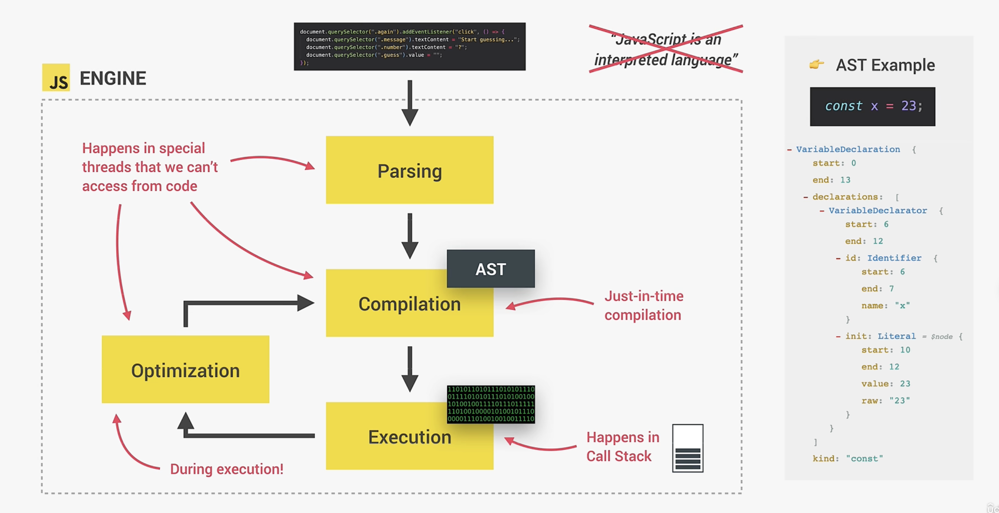
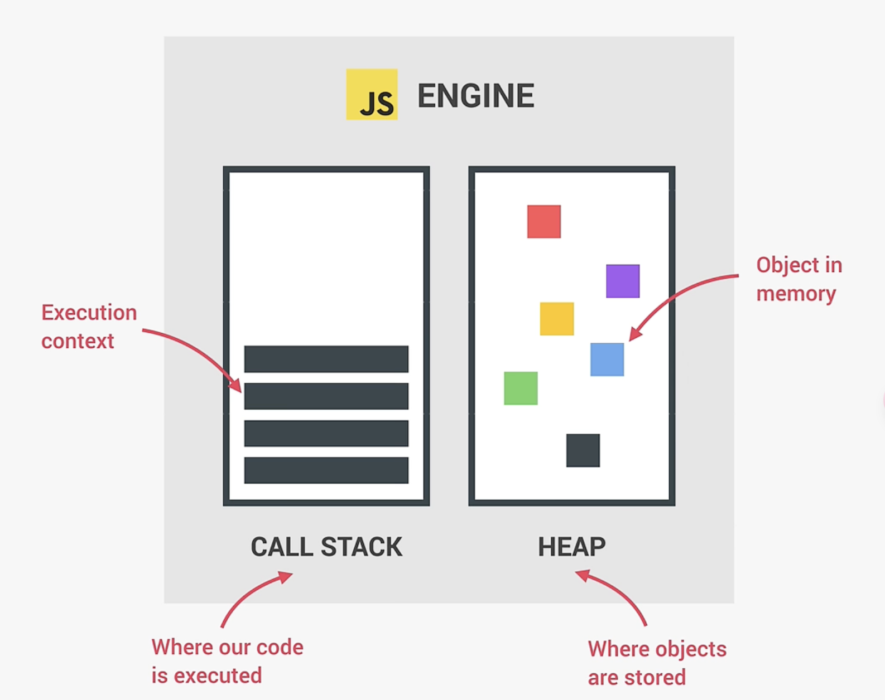
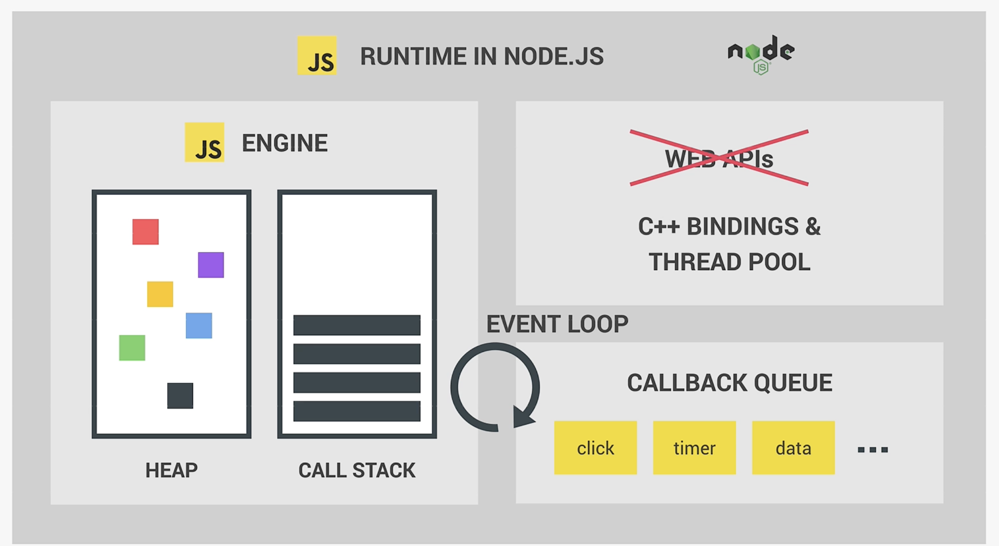
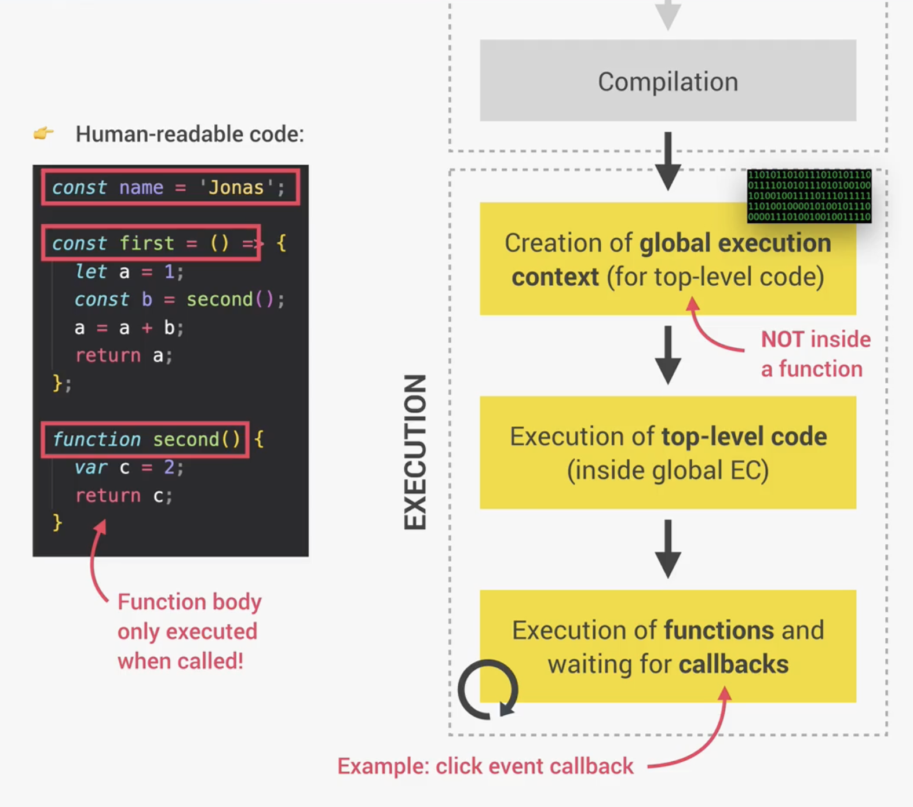
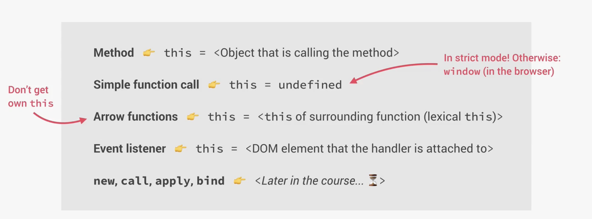
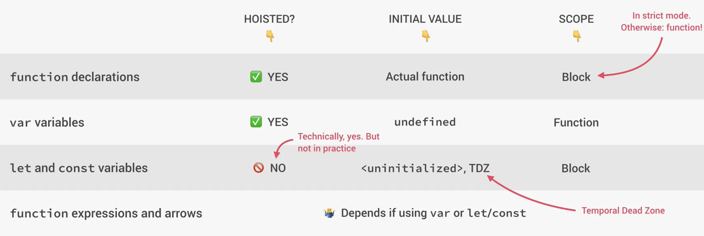
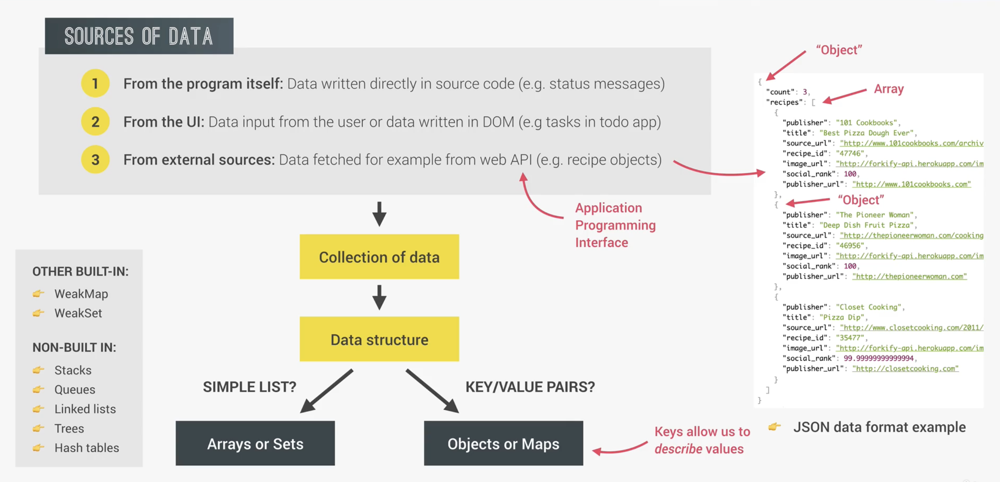
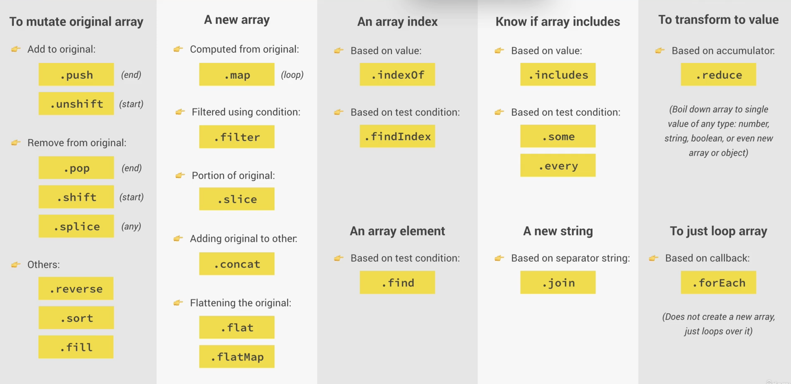

## 1、JavaScript 是什么？

> JavaScript is a `High-Level`,`Prototype-Based Object-Oriented`,`Multi-Paradigm`,`Interpreted or Just-In-Time Compiled`,`Dynamic`,`Single-Threaded`,`Garbage-Collected` Programming Language with `First-Class Functions` and a `Non-Blocking Event Loop` Concurrency Model.

- `High-Level`：诸如 C 语言这样的低级编程语言，更接近计算机硬件，使用这样的编程语言需要程序员手动地去管理计算机资源（如内存等）。而诸如 JavaScript、Python 这样的高级编程语言，其提供了所谓的抽象，能够自动完成对内存的管理等等，这使得程序员远离了手动管理内存的工作，因此这样的语言也更加容易学习和使用。

- `Garbage-Collected`：JavaScript 中将内存管理工作从开发人员手中抢走的就是这个垃圾收集器，它会自动地从内存中删除旧的、不再使用的对象等等，这有点像是 JavaScript 引擎中有一个清洁工一般，他会不时地清理计算机内存资源，这样就省去了开发人员手动执行这样的操作。

- `Interpreted or Just-In-Time Compiled`：JavaScript 是一种解释型或`即时编译`的语言。

  

- `Multi-Paradigm`：JavaScript 是一种多范式编程语言。它支持现在流行的三种编程范式：**过程化编程**、**面向对象编程**及**函数式编程**。

- `Prototype-Based Object-Oriented`：JavaScript 中的面向对象特性是一种基于原型的面向对象方法。JavaScript 中除了基本值（例如数字、字符串等），所有的东西都是对象。基于原型继承，极大的简化了编程。例如它使得创建数组变得非常方便，并且可以直接使用很多原生方法等。

- `First-Class functions`：JavaScript 中函数被视为普通变量存在，我们可以将函数作为参数传递或者从函数中返回函数等等。

- `Dynamic`：和 Java 等编程语言截然相反，在 JavaScript 中，我们在声明变量时并不会将数据类型分配给变量，这意味着变量的数据类型是可以动态发生改变的。

- `Sigle-threaded`和`Non-blocking event loop`：

  

## 2、`let`关键字和`var`关键字的区别？

`let`关键字是**ES6**新引入的用来声明变量的关键字。二者区别如下：

- 使用`var`关键字在相同作用域范围下声明具有相同名称的变量时会**覆盖掉原来的变量**，而不会报错，如下所示：

  ```javascript
  var FirstName = "white";
  var FirstName = "venus";
  console.log(FirstName); // 输出 'venus'
  ```

  这在大型项目中，可能会产生不可预料的、很难发现的错误`bug`。

- 而使用`let`关键字在相同作用域范围下声明具有相同名称的变量时会**产生报错**，如下所示：

  ```javascript
  let FirstName = "white";
  let FirstName = "venus"; // Identifier 'FirstName' has already been declared
  ```

## 3、什么是 JavaScript 引擎？

- JavaScript 引擎本质上就是执行 JavaScript 的程序。每个浏览器都有自己的 JavaScript 引擎，其中最知名的是 Chrome 的`V8`。

- 任何 JavaScript 引擎总是包含一个调用栈和一个堆：

  

- JavaScript 在 Nodejs 中的运行时:

  

## 4、什么是 Excution Context？

- 执行上下文是一个存储必要信息和执行代码的 JavaScript 环境。

  

- Excution Context 中包含什么？

  - 变量环境：包括`变量声明`、`函数声明`、 `参数对象`
  - 作用域链（Scope chain）：作用域链的追踪主要用于在函数内部引用其父作用域的变量。
  - `this`关键字：每一个执行上下文都会在创建阶段（执行之前）生成`this`关键字。

    

> 注意：**箭头函数的执行上下文中是没有`参数对象`和`this`关键字的。**

- 作用域是声明了某一个变量的空间。JavaScript 现在有三种作用域：
  - **全局作用域**：在任何块级作用域和函数作用域之外，全局作用域内声明的变量在任何地方都可以访问。
  - **函数作用域**：函数作用域内声明的变量只能在函数内部访问。函数作用域也被称作本地作用域（Local Scope）。
  - **块级作用域（ES6）**：例如`if`、`for`这样的块级作用域内声明的变量只可以在块级内部访问，但是这只适用于**使用`let`和`const`声明的变量**。另一方面，在严格模式下，函数也是块级作用域。

## 5、什么是 Hoisting？

- Hoisting 具体是指变量在声明之前就可以被访问和使用。实际上在创建执行上下文（Excution Context）的阶段（执行之前），会扫描所有的变量声明，对每一个变量，都会在变量环境对象中创建一个新的属性。

  

## 6、内置数据结构？



- Array 和 Set：数组是**有序、可重复**的，当需要操作数据时就使用数组。集合是**无序、无重复**的，可以用来删除数组中重复元素等等。
- Object 和 Map：两者都是以键值对形式存储元素的，但 Map 的键可以是任意数据类型，并且具有更好的性能。Object 的优点是能够很方便的访问元素。当需要包含函数在内、使用 JSON 格式数据时就使用 Object。

## 7、什么是闭包？

- 闭包是指在创建函数时锁定执行上下文中的变量，这意味着尽管执行上下文已经消失，函数还能够使用执行上下文中的变量。
- 闭包提供了一个函数能够访问其父函数所有变量的功能，**尽管父函数已经退出，消失在栈中**。这就像是函数有了可以存放父函数中变量的背包一样。

## 8、数组的 23 个方法



## 8、DOM API


