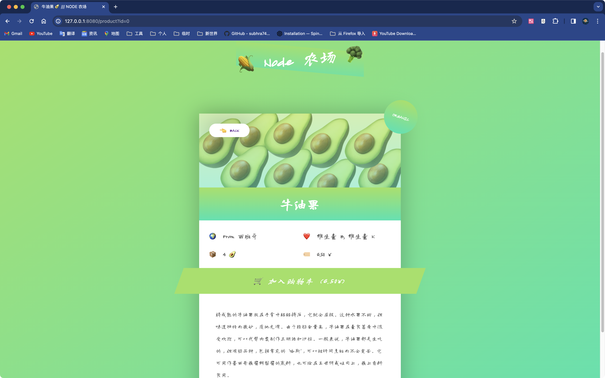
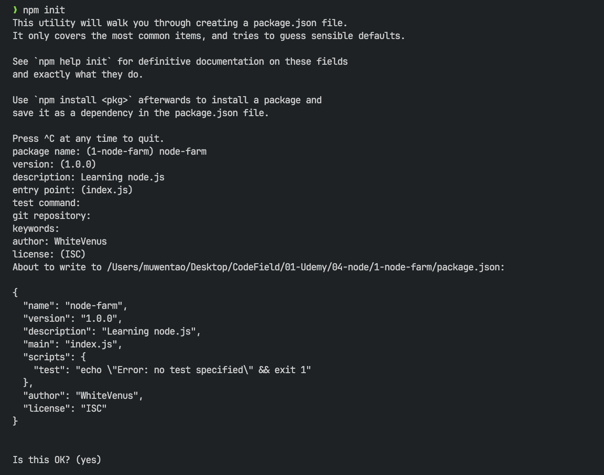
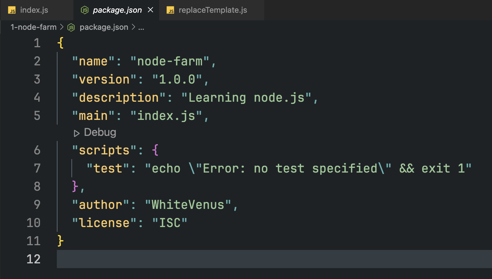

## 1、Node.js是什么

>  Node.js 是基于开源 v8 引擎的 JavaScript 运行时。

我们都知道`HTML`、`CSS`和`Javascript`是运行在浏览器中的，这种情况下浏览器就是一个`Javascript运行时`，事实上`Javascript`代码不仅仅能在浏览器中运行，它还可以在另外一个`Javascript Runtime`（例如**Node.js**）中运行。所谓的`Javascript Runtime`就是一个可以运行`javascript`代码的**容器、环境**。`javascript`代码能够在`node.js`环境中运行，主要依赖的就是谷歌开源的**V8引擎**。通俗的讲：**Node.js就是一个开源的，跨平台的javascript运行环境**。

基于此，我们可以使用`Node.js`开发服务器应用（这意味着在网页开发的服务端（就是平常所说的后端）使用`javascript`），除此以外，使用`Node.js`还可以开发工具类应用（例如`webpack`、`vite`、`babel`）、桌面端应用（例如`vsCode`、`Figma`、`Postman`都是基于**electron**(`一个基于Node的桌面级开发框架`)开发的）。

+ [Node.js官网](https://nodejs.org/en)
+ [Nodejs官方文档](https://nodejs.org/docs/latest/api/)

**单线程**、**基于事件驱动**、**非阻塞式IO模型**这三个特点使得`node.js`非常轻量化和高效，非常适合构建一个快速的、高伸缩性的数据密集型应用程序。例如基于`NoSQL`数据库（MongoDB）构建数据库API，构建一个数据流的应用程序（如：YouTube等），构建实时聊天应用程序，构建服务端应用程序等等。但`node.js`并不适合构建需要在服务端进行大量诸如图片处理、文件压缩等操作的应用程序，这种在服务端有着重量级操作的应用程序应该使用`Java`、`python`、`PHP`这类编程语言构建。使用`node.js`有以下的一些优点：

+ 使用一种语言（`javascript`）进行全栈开发
+ 非常活跃的社区
+ 有着非常丰富的[开源库](https://www.npmjs.com/)（`npm`）可以被任何人使用

::: tip 总结

+ Node.js是一个可以运行`javascript`代码的容器环境（称为**JavaScript运行时**）。
+ 基于Node.js可以开发**服务器应用**、**工具类应用**、**桌面端应用**。
+ Node.js三大核心特性：**单线程**、**基于事件驱动**、**非阻塞式IO模型**

:::

### 使用Node.js的注意事项：

+ 在node中是不能够使用和DOM、BOM相关的Web API的。
+ `node`中提供的API多是和文件读写、网络请求相关的。
+ `node`中的顶级对象为`global`，与`global`指向同一个对象的是`globalThis`变量。

## 2、Node.js初体验——使用`fs`模块对文件进行读写

引入`fs`模块：

```javascript
const fs = require("fs"); // node.js默认使用CommonJS作为模块导入规范
```

开始读写文件；

```javascript{2,6}
// Blocking, synchronous way
const textIn = fs.readFileSync("./txt/input.txt", "utf-8");
console.log(textIn);

const textOut = `This is what we konw about the avocado: ${textIn}.\nCreate on ${Date.now()}`;
fs.writeFileSync("./txt/output.txt", textOut);
console.log("File written!");

/* 以下是输出结果：
The avocado 🥑 is popular in vegetarian cuisine as a substitute for meats in sandwiches and salads because of its high fat content 😄
File written!
*/
```

以上是`node.js`基于**同步**的方式对文件进行读写操作：注意到第**2**行与第**6**行代码，是通过`fs`模块的`readFileSync(path [, options])`以及`writeFileSync(file, data[, options])`API完成文件**同步**文件读写的。

所谓同步的操作就是代码逐行执行，下一行代码要等上一行代码执行完毕才会开始执行，这被称作是**阻塞**。

但当要进行的操作非常缓慢时（例如读取一个非常大的文件），就会是一个严重的问题。因此`node.js`提供了一种以**异步**、**非阻塞**的方式解决这个问题，异步操作是在后台运行的，这意味着下一行代码无需等待上一行代码执行完毕就会开始执行。如下所示：

```javascript{2,5,7,10}
// Non-blocking, asynchronous way
fs.readFile("./txt/start.txt", "utf-8", (err, data1) => {
  if (err) return console.log("ERROR! 💥");

  fs.readFile(`./txt/${data1}.txt`, "utf-8", (err, data2) => {
    console.log(data2);
    fs.readFile(`./txt/append.txt`, "utf-8", (err, data3) => {
      console.log(data3);

      fs.writeFile("./txt/final.txt", `${data2}\n${data3}`, "utf-8", (err) => {
        console.log("Your file has been written 😄");
      });
    });
  });
});
console.log("Will read file!");

/* 以下是输出结果：
Will read file!
The avocado 🥑 is also used as the base for the Mexican dip known as guacamole, as well as a spread on corn tortillas or toast, served with spices.
APPENDIX: Generally, avocados 🥑 are served raw, but some cultivars can be cooked for a short time without becoming bitter.
Your file has been written 😄
*/
```

注意上述代码中高亮行是通过`fs`模块中异步API`readFile(path [, options], callback)`、`writeFile(file, data[, options], callback)`完成文件读写的。

可以看到`node.js`的异步代码块中处处充满回调函数，事实上上面这种层层嵌套的写法会使得代码难以阅读，这种现象被称作是**回调地狱**，可以使用`ES6`中的`Promise`或者`ES8`中的`async/await`解决，从而避免这种层层嵌套的代码格式。

## 3、Node.js初体验——使用`http`模块构建一个Web服务器

引入`http`模块：

```javascript
const http = require("http");
```

创建一个简易的Web服务器并监听`8080`端口：

```javascript
const server = http.createServer((req, res) => {
  console.log(req.url);
  // return a response
  res.end("Hello from the server!");
})

server.listen(8000, "127.0.0.1", () => {
  console.log("Listening to requests on port 8000");
});
```

在浏览器中访问`127.0.0.1:8000`会返回以下页面：

``

## 4、Node.js初体验——使用`url`模块完成页面路由的映射

引入`url`模块：

```javascript
const url = require("url");
```

使用`if/else`基于不同的`url`执行不同的逻辑代码：

```javascript
const server = http.createServer((req, res) => {
  const pathName = req.url;
  if (pathName === "/" || pathName === "/overview") {
    res.end("This is the OVERVIEW");
  } else if (pathName === "/product") {
    res.end("This is the PRODUCT");
  } else {
    res.writeHead(404, {
      "Content-type": "text/html",
      "my-own-header": "hello-world",
    });
    res.end("<h1>Page not found!</h1>");
  }
});

server.listen(8000, "127.0.0.1", () => {
  console.log("Listening to requests on port 8000");
});
```

基于上述代码，浏览器访问不同的路径便会得到不同的响应结果。

+ **获取请求中的路径参数**：

  ```javascript
  // 使用ES6的解构语法获取请求路径以及路径参数
  const { pathname, query } = url.parse(req.url, true);
  // true表示获取跟在请求url中的路径参数
  ```

::: tip 练手小项目

结合HTML、CSS与上述的入门知识的一个小Demo：




+ [Node农场](https://github.com/whitevenus/NodeFarm)

:::

## 5、NPM：包管理工具

`NPM`是包含在`Node`中用来安装和管理开源包的包管理工具。可以使用`npm init`命令初始化一个`Node`项目，从而达到更加方便管理该项目的目的。如下图所示：



运行`npm init`命令以后在该项目文件夹中生成一个名为`package.json`的文件。如下所示：



### 5.1、使用NPM安装依赖包

一个`Node`项目包含两种依赖，分别是普通依赖（`dependencies`）和开发依赖（`devDependencies`），普通依赖是项目运行中所需要的依赖，例如`express`、`slugify`这样的依赖，而开发依赖只是方便我们开发项目的工具，例如`nodemon`这样的依赖，在项目打包发布过程中并不会包含开发依赖。

使用`NPM`安装依赖的命令是：`npm i packageName`（安装普通依赖），事实上上述命令是`npm install packageName --save`的简写形式。使用`npm i packageName --dev-save`命令安装开发依赖。安装以后会发现项目文件夹中多出一个名为`node_modules`的文件夹，其中内容正是我们的项目所依赖的所有依赖包。

通常情况下我们所安装的依赖包只会在当前项目中生效，如果想要全局安装（使依赖包在整个计算机用户环境中生效），可以使用`npm i packageName -g`命令安装，事实上上面的命令是`npm install packageName --global`命令的简写形式。全局依赖和项目依赖的使用方式稍有不同，全局依赖可以直接在任何命令行终端中使用，而项目依赖需要在`package.json`文件中配置`scripts`的内容，将依赖命令写在其中，之后使用`npm run ScriptName`运行依赖工具。以`nodemon`举例：

```json{7}
{
  "name": "node-farm",
  "version": "1.0.0",
  "description": "Learning node.js",
  "main": "index.js",
  "scripts": {
    "start": "nodemon index.js"
  },
  "author": "WhiteVenus",
  "license": "ISC",
  "dependencies": {
    "slugify": "^1.6.6"
  },
  "devDependencies": {
    "nodemon": "^3.0.2"
  }
}
```

在`package.json`文件中配置依赖启动命令之后，就可以使用`npm run start`运行本项目中配置好的依赖工具，甚至可以使用`npm start`简写命令来完成相同的事情。

### 5.2、使用NPM对包进行管理

使用`npm outdated`检查项目中过时的依赖包（有新版本存在），例如：

```bash
❯ npm outdated
Package  Current  Wanted  Latest  Location              Depended by
slugify    1.0.0   1.6.6   1.6.6  node_modules/slugify  1-node-farm
```

另外`package.json`文件中依赖的版本前面如果是`^`，则表示接受一切更新（包括主版本、次版本、补丁版本），例如：

```json{4}
{
	...
  "dependencies": {
    "slugify": "^1.0.0"
  },
  "devDependencies": {
    "nodemon": "^3.0.2"
  }
}
```

而`~`表示只接受补丁版本的更新，当上述代码第4行被修改为：

```json
"slugify": "~1.0.0"
```

再次运行`npm outdated`命令会得到以下结果：

```bash{3}
❯ npm outdated
Package  Current  Wanted  Latest  Location              Depended by
slugify    1.0.0   1.0.2   1.6.6  node_modules/slugify  1-node-farm
```

使用`npm update packageName`可以更新依赖、`npm uninstall packageName`删除依赖。当向别人分享项目代码或者上传GitHub时，不需要将`node_modules`一起上传，别人拿到项目目录结构后，只需要执行`npm install`命令即可自动根据`package.json`文件安装相应依赖。


