## Node的幕后

### Node架构

`Node`在运行时有两个非常重要的依赖：`V8`引擎、`libuv`，V8负责将`javascript`代码转换为计算机可以理解执行的机器语言。`libuv`是一个重点关注**异步IO**的开源库，它使得Node能够访问计算机底层的操作系统、文件系统、网络等等，除此以外，`libuv`为`Node`提供了两个重要的特征：**事件循环**、**线程池**。

+ 事件循环负责处理简单的任务，例如执行回调函数以及处理网络IO请求等等。
+ 线程池则负责较重的任务，例如文件访问、压缩等等类似的事情。

事实上，Node除了依赖`V8`和`libuv`以外，还依赖其他的一些库，如下所示：

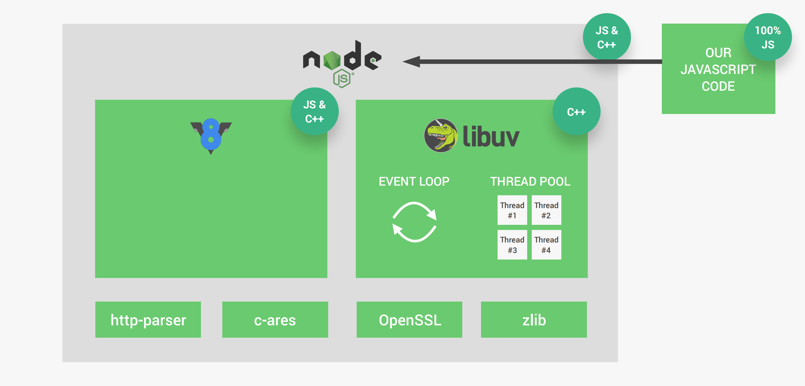

### 线程和线程池

Node进程（正在执行的一个程序）在计算机上是以单线程（可以想象成一个串行的指令序列）的方式运行的。Node运行的过程大致如下：

+ 首先初始化程序（加载所有的相关模块）
+ 执行“顶层”代码（不在回调函数中的代码）
+ 注册所有的回调函数
+ 之后开始进行事件循环

但有些复杂的事情依靠事件循环是处理不了的（会对单线程形成阻塞），这时候`libuv`所提供的**线程池**就会派上用场。线程池提供了额外的4个线程（也可以自己手动配置128个线程）负责将繁重的任务从事件循环中接过来（程序在幕后会自动判断哪些是厚重的任务，之后会自动处理通过多出来的线程处理复杂的任务，无需开发人员参与）。事实上，线程池会接过的常见复杂任务是：与**文件系统**、**密码缓存**、**压缩**、**DNS解析**等等这些会对线程形成阻塞的任务。

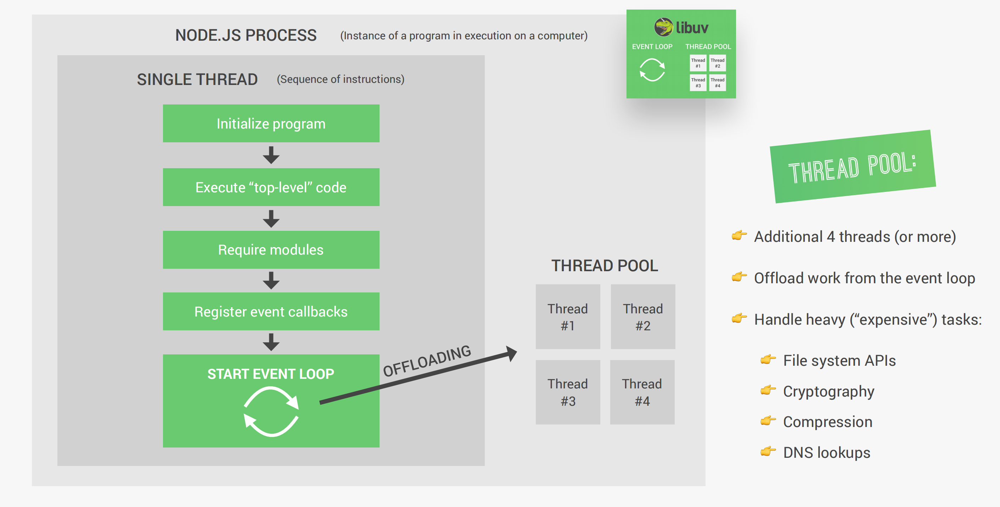

下面这段代码使用到`crypto`模块实现与密码相关的一系列操作，这种可能会对单线程产生阻塞的复杂任务会被分配给线程池执行，因为线程池中默认线程是4个，所以下列四个方法执行时间会大致相同：

```JavaScript
const crypto = require("crypto");

const start = Date.now();

// 和crypto模块相关的会调用libuv的额外四个线程池来执行，所以他们的执行时间是大致相同的。
crypto.pbkdf2("password", "salt", 100000, 1024, "sha512", () => {
  console.log(Date.now() - start, "Password encrypted");
});
crypto.pbkdf2("password", "salt", 100000, 1024, "sha512", () => {
  console.log(Date.now() - start, "Password encrypted");
});
crypto.pbkdf2("password", "salt", 100000, 1024, "sha512", () => {
  console.log(Date.now() - start, "Password encrypted");
});
crypto.pbkdf2("password", "salt", 100000, 1024, "sha512", () => {
  console.log(Date.now() - start, "Password encrypted");
});

console.log("Hello from the top-level code");


/* 执行结果：
Hello from the top-level code
997 Password encrypted
1003 Password encrypted
1034 Password encrypted
1035 Password encrypted
*/
```

但若是手动设置了线程池中线程数为`1`，则四个方法便会依次被执行：

```JavaScript{4}
const crypto = require("crypto");

const start = Date.now();
process.env.UV_THREADPOOL_SIZE = 1;

// 和crypto模块相关的会调用libuv的额外四个线程池来执行，所以他们的执行时间是大致相同的。
crypto.pbkdf2("password", "salt", 100000, 1024, "sha512", () => {
  console.log(Date.now() - start, "Password encrypted");
});
crypto.pbkdf2("password", "salt", 100000, 1024, "sha512", () => {
  console.log(Date.now() - start, "Password encrypted");
});
crypto.pbkdf2("password", "salt", 100000, 1024, "sha512", () => {
  console.log(Date.now() - start, "Password encrypted");
});
crypto.pbkdf2("password", "salt", 100000, 1024, "sha512", () => {
  console.log(Date.now() - start, "Password encrypted");
});

console.log("Hello from the top-level code");

/* 执行结果：
Hello from the top-level code
887 Password encrypted
1774 Password encrypted
2658 Password encrypted
3545 Password encrypted
*/
```

### 事件循环

事件循环作为`Node`中最核心的架构，所有的非顶层代码（所有的回调函数）都会执行在事件循环中。尽管某些复杂的任务（例如与文件系统相关的任务）会被交到线程池中运行，但这实际上也是由事件循环所负责的。`Node`是围绕着回调函数而构建的，也就是说Node是基于事件驱动的架构。

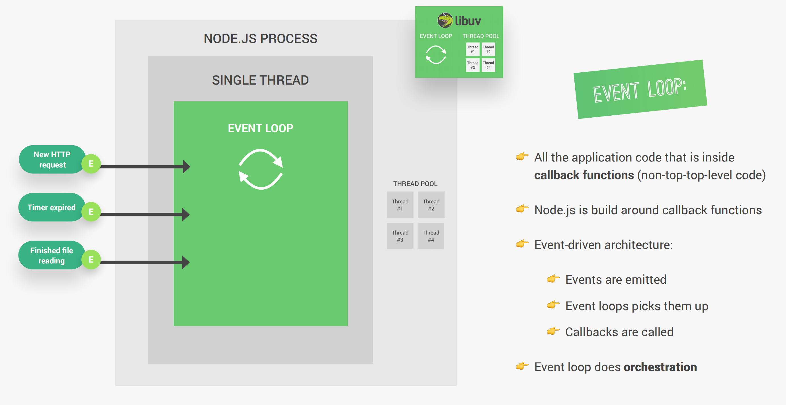

当`Node`被启动时，事件循环就会开始执行。事实上，事件循环有很多个阶段，其中比较重要的有四个阶段：

+ 定时器的执行，例如`setTimeout（）`方法。
+ 当事件循环执行完上个阶段回调队列中的所有回调函数后，便会进入I/O轮询和I/O回调的阶段。这一阶段通常与文件数据获取、网络IO请求相关。
+ `setImmediate`回调阶段，`Immediate`是一种特殊的定时器，如果我们想在I/O回调阶段之后立即处理回调，就可以使用它。
+ 之后的阶段是：关闭回调阶段，在这阶段所有的关闭事件都会被处理。例如WebServer关闭的时候。

事实上，除了以上的四个阶段以外，还有两个特殊的队列，分别是：`process.nextTick()`队列和其他微任务队列（处理`Promises`的任务队列）。在这两个阶段中如果存在回调函数，他会在当前某一阶段执行完毕之后立即执行，而不是等到时间循环完成。

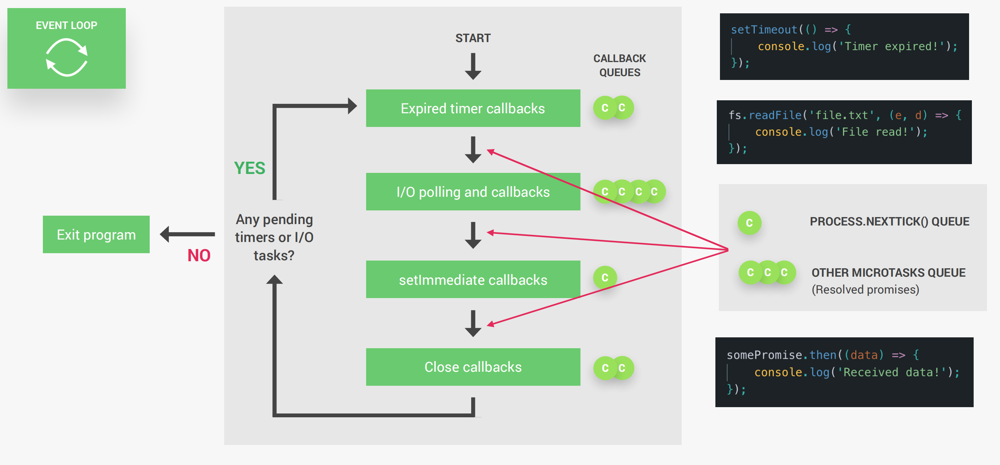

当事件循环发现没有存在的定时器或者I/O请求之后，便会退出程序。

 Node如此轻量、可扩展的重要原因就是基于**时间循环**和**线程池**，另外因为`Node`是单线程的，因此要格外注意避免阻塞线程的做法，以下是一些建议：

+ 不要在**回调函数**中使用`fs`、`cryto`、`zlib`模块中的同步版本方法。
+ 不要在时间循环中进行超级复杂的计算。
+ 加载非常大的JSON文件要多加注意。
+ 不要使用太复杂的正则表达式，例如反向引用等等。

虽然现在有很多新的方法（例如**引入子进程**等）可以避免线程阻塞的问题，但是遵循上面的建议对初学者来说非常重要。

### 事件驱动架构

`Node`中的很多模块（例如HTTP、文件系统、计时器）都是基于事件驱动构建的，事实上我们也可以使用这种架构去写代码。在Node中，有一些发出命名事件的事件发射器对象，一旦应用程序中发生了重要事件（例如HTTP请求、定时器等等），事件侦听器就可以捕获到这些事件，并调用附加在`Event listener`上的回调函数来发出事件。


创建自己的`Emitter`对象：

```javascript
const EventEmitter = require("events");

const myEmitter = new EventEmitter();

// 创建监听器
myEmitter.on("newSale", () => {
  console.log("There was a new Sale!");
});
// 创建监听器
myEmitter.on("newSale", () => {
  console.log("Customer: WhiteVenus");
});
// 创建监听器
myEmitter.on("newSale", (stock) => {
  console.log(`There are now ${stock} items left in stock.`);
});
// 发射事件,可以同时传入参数
myEmitter.emit("newSale", 9);

/* 输出结果：
There was a new Sale!
Customer: WhiteVenus
There are now 9 items left in stock.
*/
```

更好的做法是创建一个`EventEmitter`的子类：

```javascript{3,4,5,6,7,9}
const EventEmitter = require("events");

class Sale extends EventEmitter {
  constructor() {
    super();
  }
}

const myEmitter = new Sale();

// 创建监听器
myEmitter.on("newSale", () => {
  console.log("There was a new Sale!");
});
// 创建监听器
myEmitter.on("newSale", () => {
  console.log("Customer: WhiteVenus");
});
// 创建监听器
myEmitter.on("newSale", (stock) => {
  console.log(`There are now ${stock} items left in stock.`);
});
// 发射事件
myEmitter.emit("newSale", 9);

/* 输出结果：
There was a new Sale!
Customer: WhiteVenus
There are now 9 items left in stock.
*/
```

基于事件驱动创建Web服务器：

```javascript
const http = require("http");
const server = http.createServer();
server.on("request", (req, res) => {
  console.log("Request received !");
  console.log(req.url);
  res.end("Request received");
});

server.on("request", (req, res) => {
  console.log("Another request 😄");
});

server.on("close", () => {
  console.log("Server closed");
});

// 监听主机指定端口
server.listen(8000, "127.0.0.1", () => {
  console.log("Waiting for request.....");
});

/* 输出结果：
Request received !
/
Another request 😄
Request received !
/favicon.ico
Another request 😄
*/
```

### Streams

通过流`Streams`，可以实现一块一块（`chunks`）地读取数据，而不用一次性读取完整的数据，这样就不需要将所有的数据都存入内存中了，是一种节省内存空间的读取数据方式。流的方式非常适合处理大的数据，例如视频等。

在`Node`中有四种流，分别是：`Readable Streams`、`Writable Streams`、`Duplex Streams`、`Transform Streams`，其中比较重要的是`Readable Streams`和`Writable Streams`，都是见名知义的。在`Node`中，流实际上是`EventEmitter`的实例，因此所有的流都可以`emit`和`listen`，就如同上一小节一样。

在`Readable Streams`中比较重要的两个事件是：`data`和`end`。除此以外还有两个比较重要的方法`pipe()`和`read()`。具体可以看下图：

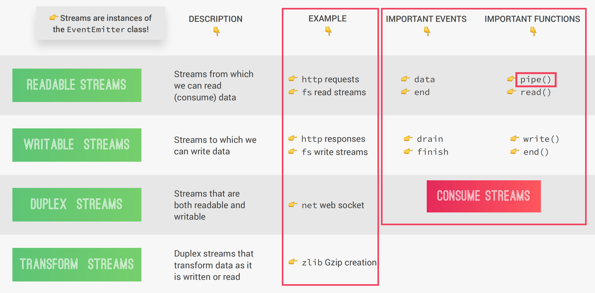

不使用流的形式读取大文件返回给客户端：

```javascript
const fs = require("fs");
const server = require("http").createServer();

server.on("request", (req, res) => {
  // Solution 1
  fs.readFile("test-file.txt", (err, data) => {
    if (err) console.log(err);
    res.end(data);
  });
});

server.listen(8000, "127.0.0.1", () => {
  console.log("Listening .....");
});
```

使用流的方式完成：

```javascript
const fs = require("fs");
const server = require("http").createServer();

server.on("request", (req, res) => {
  // Solution 2
  const readable = fs.createReadStream("test-file1.txt");
  readable.on("data", (chunk) => {
    res.write(chunk);
  });
  readable.on("end", () => {
    console.log("Read Finished");
    res.end();
  });
  readable.on("error", (err) => {
    console.log(err);
    res.statusCode = 500;
    res.end("File not found!");
  });
});

server.listen(8000, "127.0.0.1", () => {
  console.log("Listening .....");
});
```

事实上响应对象并不能像接受数据一样快的发送数据，这种现象被称为**背压**，因此可以通过`pipe`的方式处理（这才是更优雅的方式）：

```javascript
const fs = require("fs");
const server = require("http").createServer();

server.on("request", (req, res) => {
  // Solution 3
  const readable = fs.createReadStream("test-file.txt");
  readable.pipe(res);
});

server.listen(8000, "127.0.0.1", () => {
  console.log("Listening .....");
});

```

### Node模块的实际工作方式

在`Node`模块系统中，每一个`JavaScript`文件都被视作一个单独的模块。Node使用`CommonJS`模块系统（包括`require`、`exports`、`modules.exports`）导入导出模块，这在服务器上表现不错。除了`CommonJS`模块系统，现在还有原生的`ES`模块系统（包含`import`和`export`）。

::: info 

`require("test-module");`在幕后都做了什么？

:::

+ 根据标识参数解析加载模块文件
+ 包装
+ 模块代码被执行
+ 返回模块导出
+ 缓存整个模块

Node是怎么依据标识参数解析加载模块文件的呢？

::: tip

实际上有三类模块：`core modules`、`Developer modules`以及`3rd-party modules`。

当`require`收到路径标识参数后，首先会尝试加载具有该名称的核心模块。如果标识参数是以`./`或者`../`开头的，这意味着该模块是一个开发人员自己写的模块，Node就会尝试加载指定路径下的模块，如果那个模块文件不存在，Node就会寻找同名文件夹并加载其中的`index.js`文件。最后，如果既不是核心模块也不是开发人员自己编写的模块，Node就会假定该模块是第三方模块，去`node_modules/`文件夹下尝试加载。最终若还是没找到便会报错。

:::

加载完模块以后，模块的代码会被包装成一个特殊的函数。举个例子，`require`并不是`javascript`自带的，但我们可以在代码中无痛使用它来导入其他模块，就是因为Node启动以后，会将我们的代码包装在下面的这个特殊函数中：

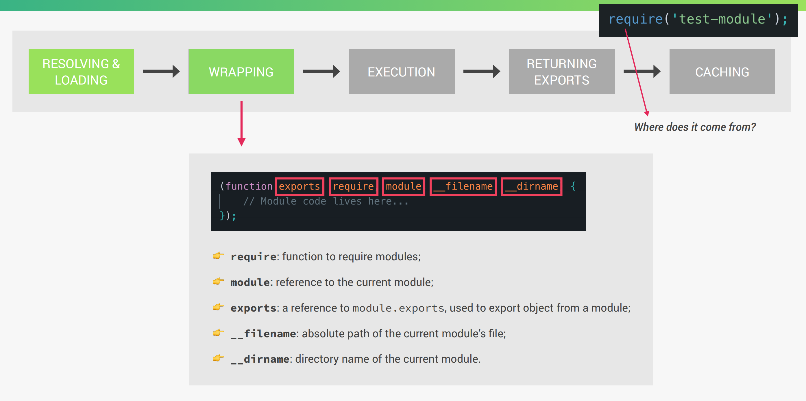

可以通过以下代码查看：

```javascript
console.log(arguments);
console.log(require("module").wrapper);
```

经过解析加载、包装执行，就会返回一些被加载模块的导出，这些导出存储在`module.exports`对象中，如果要导出单个变量、函数或者类，直接复制给`exports`对象即可，若是要导出多个函数、类、变量等，就将要导出的内容作为属性添加到`exports`对象身上即可。

完成上述步骤以后，实际上还会将模块缓存起来，若是之后再导入则会直接从缓存中进行检索。

## 解决回调地狱

```javascript
const fs = require("fs");
const superagent = require("superagent");

fs.readFile(`${__dirname}/dog.txt`, (err, data) => {
  console.log(`Breed: ${data}`);

  superagent
    .get(`https://dog.ceo/api/breed/${data}/images/random`)
    .end((err, res) => {
      if (err) return console.log(err.message);
      console.log(res.body);
      console.log(res.body.message);

      fs.writeFile("dog-img.txt", res.body.message, (err) => {
        if (err) return console.log(err.message);
        console.log("Rondom dog image saved to file!");
      });
    });
});
```

以上是一个典型的回调地狱问题，当内层嵌套过多的回调函数会使代码变得非常难以阅读。

### 使用Promise解决

```javascript
const fs = require("fs");
const superagent = require("superagent");

const readFilePro = (file) => {
  return new Promise((resolve, reject) => {
    fs.readFile(file, (err, data) => {
      if (err) reject("I could not find that file 😅");
      resolve(data);
    });
  });
};

const writeFilePro = (file, data) => {
  return new Promise((resolve, reject) => {
    fs.writeFile(file, data, (err) => {
      if (err) reject("Could not write the file!");
      resolve("success");
    });
  });
};

// 经过Promise改良后的：
readFilePro(`${__dirname}/dog.txt`)
  .then((data) => {
    console.log(`Breed: ${data}`);
    return superagent.get(`https://dog.ceo/api/breed/${data}/images/random`);
  })
  .then((res) => {
    console.log(res.body.message);
    return writeFilePro(`${__dirname}/dog-img.txt`, res.body.message);
  })
  .then(() => {
    console.log("Random dog image saved to file!");
  })
  .catch((err) => {
    console.log(err);
  });
```

使用`Promise`可以解决回调函数多层嵌套的问题，这使得代码可读性得到了极大的增强，并且更加容易理解。

### 使用async/await解决

```javascript
const fs = require("fs");
const superagent = require("superagent");

const readFilePro = (file) => {
  return new Promise((resolve, reject) => {
    fs.readFile(file, (err, data) => {
      if (err) reject("I could not find that file 😅");
      resolve(data);
    });
  });
};

const writeFilePro = (file, data) => {
  return new Promise((resolve, reject) => {
    fs.writeFile(file, data, (err) => {
      if (err) reject("Could not write the file!");
      resolve("success");
    });
  });
};

const getDogImg = async () => {
  try {
    const data = await readFilePro(`${__dirname}/dog.txt`);
    console.log(`Breed: ${data}`);

    const res1Pro = superagent.get(
      `https://dog.ceo/api/breed/${data}/images/random`
    );
    const res2Pro = superagent.get(
      `https://dog.ceo/api/breed/${data}/images/random`
    );
    const res3Pro = superagent.get(
      `https://dog.ceo/api/breed/${data}/images/random`
    );
    const all = await Promise.all([res1Pro, res2Pro, res3Pro]);
    const imgs = all.map((el) => el.body.message);
    console.log(imgs);

    await writeFilePro(`${__dirname}/dog-img.txt`, imgs.join("\n"));
    console.log("Random dog image saved to file!");
  } catch (err) {
    throw err;
  }
  return "2: Ready 🐶";
};
(async () => {
  try {
    console.log("1: Will get dog img");
    const x = await getDogImg();
    console.log(x);
    console.log("3: Done getting dog img");
  } catch (err) {
    console.log("Error: 💥");
    console.log(err);
  }
})();
```

使用`async/await`使得我们的代码看起来更像是同步代码，不需要再写大量的回调函数，这让代码显得更为优雅。

## Express是什么？

`Express`是一个非常流行的最小`node.js`框架，这意味着它是运行在`node.js`之上的一层高级抽象。事实上，`Express`是用`node.js`完成编写的。

`Express`包含非常强大有用的功能集，例如：复杂的路由、更简单地处理请求和响应、服务端渲染、中间件等等。这使得开发`node.js`应用程序变得非常简单快速，因为使用`Express`意味着我们不需要重新发明轮子。另外`Express`让我们更容易地以MVC架构组织代码。

### 使用Express构建简易Web服务器

```javascript
const express = require("express");

const app = express();

app.get("/", (req, res) => {
  res.status(200).send("Hello from the server side.");
});

const port = 3000;
app.listen(port, () => {
  console.log(`App runing on port ${port}...`);
});
```

以上是服务端返回一个字符串给用户端，也可以使用`json()`方法返回JSON数据给客户端：

```javascript{4}
app.get("/", (req, res) => {
  res
    .status(200)
    .json({ message: "Hello from the server side.", app: "Natours" });
});
```

除了对使用`get`方法的客户端请求作出响应外，也接受`post`等方法的客户端请求：

```javascript
app.post("/", (req, res) => {
  res.status(200).send("You can post to this pointend.");
});
```

### REST API

`API（Application Programming Interface）`指得是一个软件的一部分被另一个软件使用，目的是达成应用程序之间互相通信。例如`Web API`：服务端通过API提供数据给客户端使用。当然除了WebAPI以外，还有其他类型的API，例如`node.js`中的`fs`和`http`模块提供了非常多的API供开发人员使用，`DOM API`提供非常多的API供开发人员操作`DOM`等等。

::: info

那`REST API`是什么呢？

:::

`REST（Representational States Transfer）`：表述性状态转移，是一种以逻辑方式构建`Web API`的方法，使得使用API变得更加方便简单。具体该如何构建`REST API`呢？只需要遵循下面这些原则即可：

+ 将API分离为逻辑`资源`
+ 暴露结构化的、`基于资源的URL`
+ API应该使用`HTTP方法`
+ 返回`JSON`格式数据
+ 无状态

`https://www.natours.com/addNewTour`这个URL中的`/addNewTour`通常被称作`endpoint`，但以`REST`架构来看，`endpoint`应该只包含资源，而不包含操作的动词`add`，例如`getTour`、`updateTour`都不是一个好的`endpoint`。

资源指的是一些信息的数据化表示，通常是名词。将API分离为逻辑资源，并暴露结构化的、基于资源的URL，通常使用`HTTP方法`进行操作才是符合`REST`架构的。不是`CRUD`（Creat、Read、Update、Delete）操作的也可以创建见名知义的`endpoint`，例如`/login`、`/search`等等。事实上，`endpoint`的构建是具有非常多的可能性的。

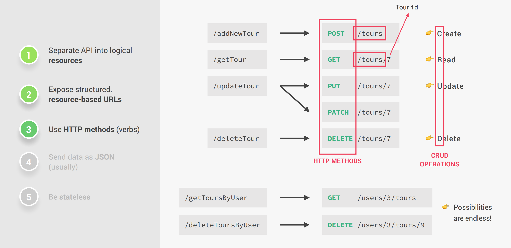

`JSON`格式数据通常经过一定的格式化后作为响应（通常称为`JSend`）返回：

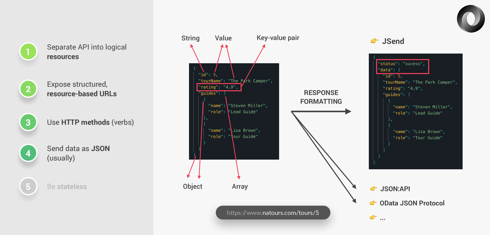

无状态RESTful API意味着所有的状态都在客户端被处理。这意味着服务端不应该记住之前的请求。

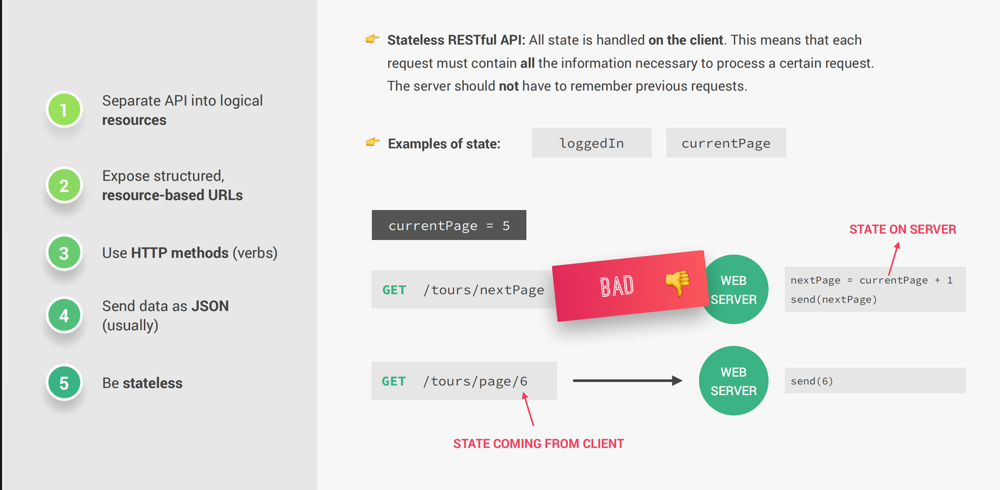

一个`RESTful API`示例：

```javascript
const fs = require("fs");
const express = require("express");

const app = express();
app.use(express.json());

const tours = JSON.parse(
  fs.readFileSync(`${__dirname}/dev-data/data/tours-simple.json`)
);

const getAllTours = (req, res) => {
  res.status(200).json({
    status: "success",
    results: tours.length,
    data: {
      tours,
    },
  });
};

const getTour = (req, res) => {
  console.log(req.params);
  const id = req.params.id * 1;
  const tour = tours.find((el) => el.id === id);
  // if (id > tours.length) {
  if (!tour) {
    return res.status(404).json({
      status: "fail",
      message: "Invalid ID",
    });
  }
  res.status(200).json({
    status: "success",
    data: {
      tour,
    },
  });
};

const createTour = (req, res) => {
  // console.log(req.body);
  const newId = tours[tours.length - 1].id + 1;
  const newTour = Object.assign({ id: newId }, req.body);
  tours.push(newTour);
  fs.writeFile(
    `${__dirname}/dev-data/data/tours-simple.json`,
    JSON.stringify(tours),
    (err) => {
      res.status(201).json({
        status: "success",
        data: {
          tour: newTour,
        },
      });
    }
  );
};

const updateTour = (req, res) => {
  if (req.params.id * 1 > tours.length) {
    return res.status(404).json({
      status: "fail",
      message: "Invalid ID",
    });
  }

  res.status(200).json({
    status: "success",
    data: {
      tour: "< Update tour here...>",
    },
  });
};

const deleteTour = (req, res) => {
  if (req.params.id * 1 > tours.length) {
    return res.status(404).json({
      status: "fail",
      message: "Invalid ID",
    });
  }

  res.status(204).json({
    status: "success",
    data: null,
  });
};

// app.get("/api/v1/tours", getAllTours);
// app.post("/api/v1/tours", createTour);
// app.get("/api/v1/tours/:id", getTour);
// app.patch("/api/v1/tours/:id", updateTour);
// app.delete("/api/v1/tours/:id", deleteTour);

app.route("/api/v1/tours").get(getAllTours).post(createTour);
app
  .route("/api/v1/tours/:id")
  .get(getTour)
  .patch(updateTour)
  .delete(deleteTour);

const port = 3000;
app.listen(port, () => {
  console.log(`App runing on port ${port}...`);
});
```

### 请求响应周期

`Express`应用程序在客户端访问服务器时收到请求，之后会创建一个请求对象和一个响应对象，经过一系列处理步骤以后将响应对象返回给客户端。为了更好的处理数据，`Express`使用一种称为`Middleware`（中间件）的东西。他可以操纵请求或响应对象，或者执行任何我们自己的代码。例如`app.use(express.json())`可以格式化请求正文，除此以外中间件可以做很多事情，例如**记录日志信息**、**设置响应头格式**、**路由**等等。


自定义中间件函数：

```javascript
app.use((req, res, next) => {
  console.log("Hello from the middleware 👋");
  next();
});
```

## MongoDB

[`MongoDB`](https://www.mongodb.com/zh-cn)是一个**NoSQL**数据库，**MongoDB**数据库包含很多**集合**（可以类比做传统数据库中的表），每一个集合包含一个或多个**文档**（就像是传统数据库表中的一条记录），也就是说一个文档是关于一个单一实体的信息集合。集合和文档的对应关系举例：

+ `blog`------->`post`
+ `users`------->`user`
+ `reviews`------->`review`

`MongoDB`中的一条记录就是一个文档，文档是由键值对组成的数据结构（类似于**JSON**对象），字段值可以包含其他文档、数组、文档数组等等（这在传统数据库中是一件非常麻烦的事情）。


### 启动数据库并连接

```shell
# 启动命令
mongod --dbpath=/Users/muwentao/data/db

# 连接命令
mongosh
```

### 创建数据库

```bash
# 该命令用于切换数据库环境，若是指定数据库不存在则会在首次存储数据到指定数据库时创建数据库
use myNewDB
# 该命令向myNewDB数据库中的tours集合中插入一条记录，若是数据库及集合都不存在则会自动创建
db.tours.insertOne({ x: 1} )
```

### 查询数据库及数据库中的集合

```shell
# 该命令用于查询数据库
show dbs

# 该命令用于查询当前数据库中的集合
show colloections
```

### 查询数据

```shell
# 该命令查询当前数据库中tours集合中的所有数据
db.tours.find()

# 该命令查询tours集合中name字段值为The Forest Hiker的记录
db.tours.find({ name: "The Forest Hiker" })

# 该命令查询tours集合中price字段值小于等于500的记录
db.tours.find({ price: {$lte: 500} })

# 该命令查询tours集合中price字段值小于500并且rating字段值大于等于4.8的记录
db.tours.find({ price: {$lt: 500}, rating: {$gte: 4.8} }) 

# 该命令查询tours集合中price字段值小于500或者rating字段值大于等于4.8的记录
db.tours.find({ $or: [{price: {$lt: 500}}, {rating: {$gte: 4.8}}]})

# 该命令查询tours集合中price字段值小于500或者rating字段值大于等于4.8的记录并且只显示name字段(投影操作)
db.tours.find({ $or: [{price: {$lt: 500}}, {rating: {$gte: 4.8}}]}, {name: 1})
```

### 更新数据

```bash
# 该命令更新tours集合中name字段值为The Snow Adventurer记录的price字段值为598
db.tours.updateOne({ name: "The Snow Adventurer" }, { $set: { price: 598 } })

# 该命令向tours集合中price字段值大于500并且rating字段值大于等于4.8记录添加premium字段，并且其值为true
db.tours.updateOne({ price: {$gt: 500}, rating: {$gte: 4.8} }, {$set: {premium: true}})
```

### 删除数据

```bash
# 该命令删除tours集合中rating字段值小于4.8的记录
db.tours.deleteMany({ rating: {$lt: 4.8} })

# 该命令删除tours集合中所有的记录
db.tours.deleteMany({})
```

通常`deleteOne`用于删除一条记录，`updateMany`用于删除多条记录。类似`insertOne`、`insertMany`、`updateOne`、`updateMany`同理。

### Mongoose

`Mongoose`是`node.js`和`MongoDB`之间的一个对象数据模型（`Object Data Modeling`）库，我们可以使用`MongoDB`驱动库编写javascript连接数据库，也可以使用`Mongoose`这个更高一层的抽象库。因为它提供了很多开箱即用的工具，允许更快、更简单的开发应用程序。它的特征如下：

+ 提供数据和关系的建模模式
+ 简单的数据校验
+ 简单的查询API
+ 中间件等等

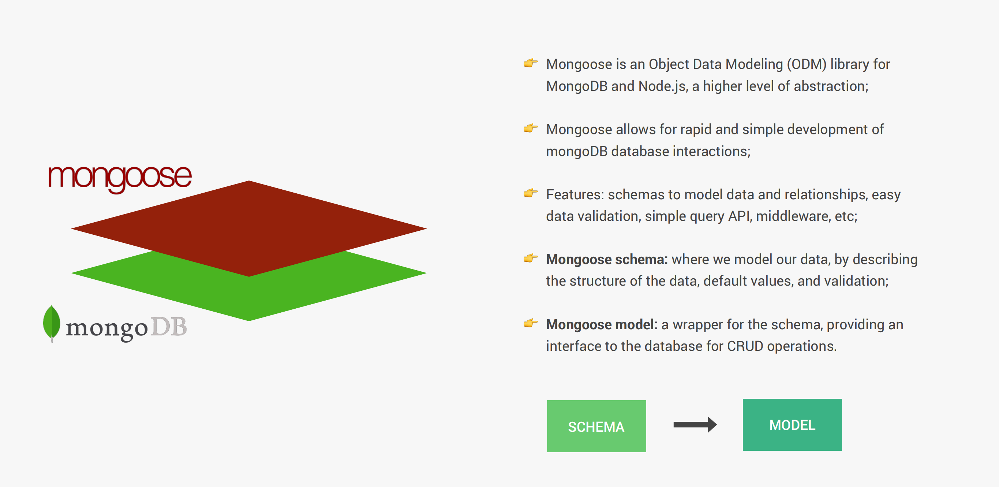

使用`Mongoose`插入一条新的数据到`MongoDB`：

```javascript
const mongoose = require("mongoose");
const dotenv = require("dotenv");

dotenv.config({ path: "./config.env" });
const app = require("./app");

const DB = process.env.DATABASE.replace(
  "<PASSWORD>",
  process.env.DATABASE_PASSWORD
);
mongoose.connect(DB).then(() => console.log("DB connection successful!"));

const tourSchema = new mongoose.Schema({
  name: {
    type: String,
    required: [true, "A tour must have a name"],
    unique: true,
  },
  rating: {
    type: Number,
    default: 4.5,
  },
  price: {
    type: Number,
    required: [true, "A tour must have a price"],
  },
});

const Tour = mongoose.model("Tour", tourSchema);

const testTour = new Tour({
  name: "The Park Camper",
  price: 997,
});

testTour
  .save()
  .then((doc) => {
    console.log(doc);
  })
  .catch((err) => {
    console.log("ERROR 💥:", err);
  });

const port = process.env.PORT || 3000;
app.listen(port, () => {
  console.log(`App runing on port ${port}...`);
});
```

## 错误处理

通常错误包含两类：**操作错误**和**编程错误**。

操作错误指的是开发人员可以预测到的在未来某些时刻不可避免会发生的错误，通常不与代码相关，例如：错误的路径请求、错误的用户输入、连接不到数据库或服务器、请求超时等等。

编程错误通常与代码相关，例如读取`undefined`变量的属性、使用不带`async`的`await`、不小心使用了`req.query`而不是`req.body`等等。

通常开发人员讲的错误处理都是指如何处理**操作错误**这一类型的错误，将处理这些错误的代码与具体逻辑代码相分离可以保证代码的干净整洁。

## JWT

`JSON WEB TOKEN`（JWT）是一个用于身份验证的无状态解决方案，这就无需在服务器上存储任何`Session`状态。`JWT`是如何工作的呢？

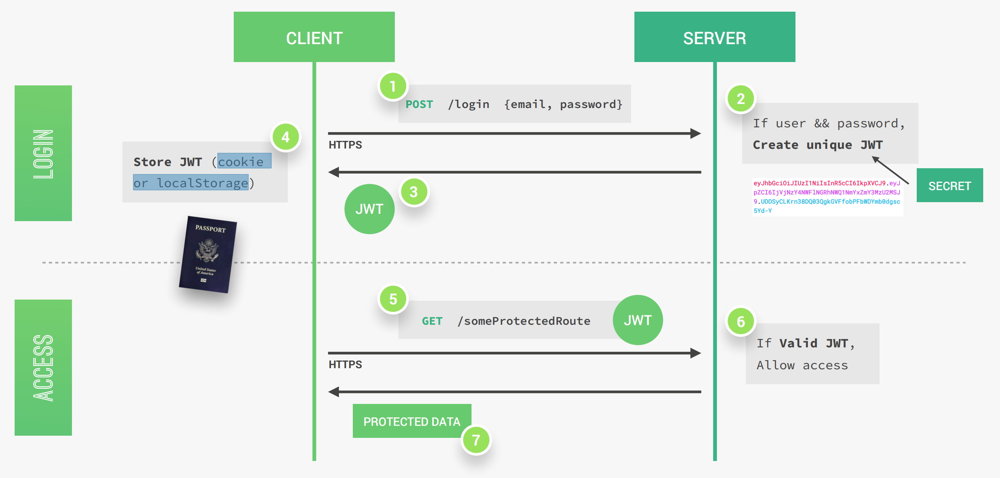

一个JWT基本上由`Header`、`PAYLOAD`、`SIGNATURE`三部分组成。Header中都是关于JWT的元数据，PAYLOAD是我们可以编码在JWT中的数据，SIGNATURE是由Header、Payload、secret of the server三部分组成的。 如下所示：

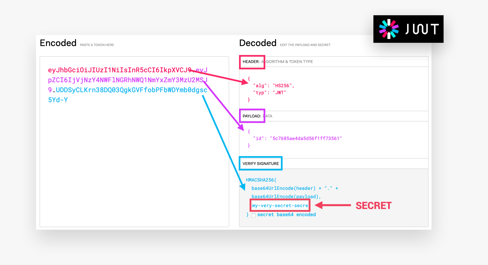

`JWT`验证机制：

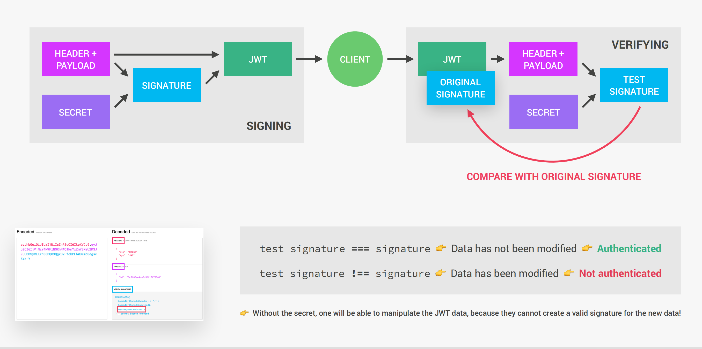

## 安全

常见的安全性问题：

+ **数据库受损**：这意味着攻击者获得了对我们数据库的访问权限。因此我们必须要对我们的密码以及重置令牌进行加密。这样尽管攻击者有访问我们数据库的权限，但我们的重要信息也较难泄露。
+ **暴力攻击**：指的是攻击者通过暴力爆破的手段尝试各种各样的密码直到找到正确的为止。我们能够做的就是将登陆请求变得慢一些，另外的策略包括限制请求速率（这抑制了来自同一个IP的请求数量）、还可以限制用户输入密码的次数防止这样的攻击。
+ **跨站脚本攻击**：指的是攻击者将含有恶意代码的脚本注入到我们的页面上运行。这样的恶意代码通常能够读取浏览器本地缓存，因此我们不应该将`jwt`存储在本地缓存中，而应该存放在`http-cookie`中。在后端方面，为了防止攻击者的跨站脚本攻击，我们应该清理用户输入数据并设置一些特殊的`http-headers`。
+ **DOS攻击**：指的是攻击者短时间内发送大量请求到服务端，导致服务端应用程序崩溃的攻击手段。可以通过限制请求速率、限制body中的负载内容、避免邪恶的正则表达式。
+ **NOSQL注入查询攻击**：这意味着攻击者输入的不是有效数据，而是注入一些查询到服务端，这可以实现不提供有效的用户名或密码也可以登陆等等。`Mongoose`防止了此类攻击，另一方面我们任然需要清理用户输入数据。

一些好的建议：

+ 总是使用`HTTPS`在客户端与服务端之间通信。
+ 创建随机的密码令牌，而不是使用日期之类的东西生成。另外要记得给令牌固定期限。
+ 在用户更改密码之后我们总是更新`jwt`
+ 永远不要使用`git`提交我们的环境变量文件
+ 不要将整个错误发送到客户端
+ 可以使用`csurf`包预防**跨站请求伪造**攻击
+ 在执行高价值操作时进行双重身份验证
+ 创建不可信令牌黑名单
+ 首次创建账户时确认电子邮件地址
+ 使用刷新令牌
+ 实现双要素身份验证
+ 防止参数污染

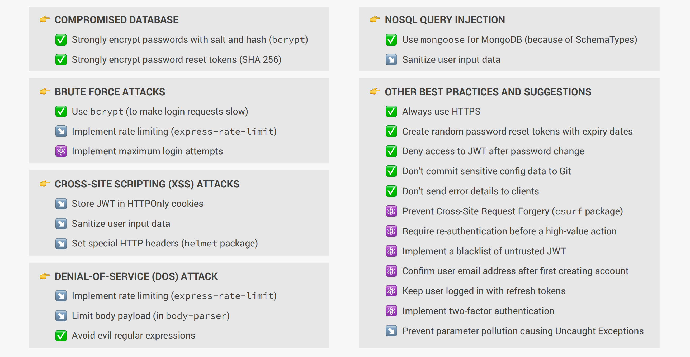


 


