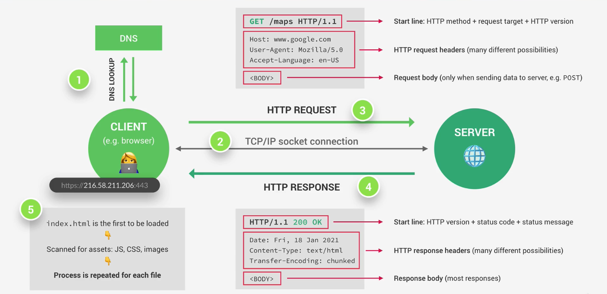
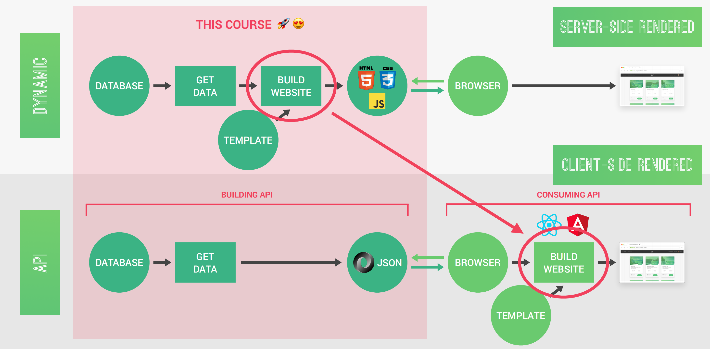
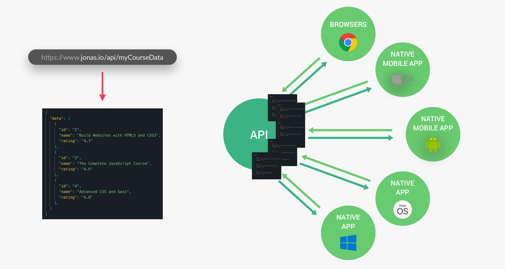
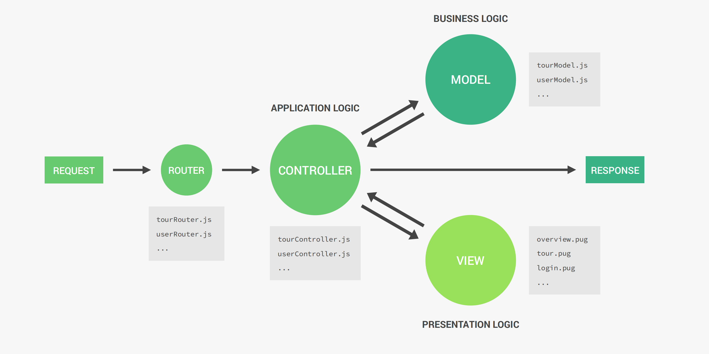
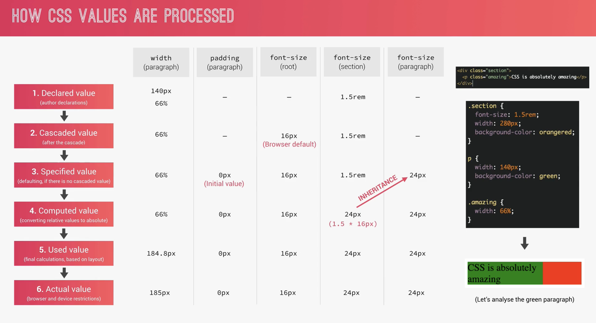
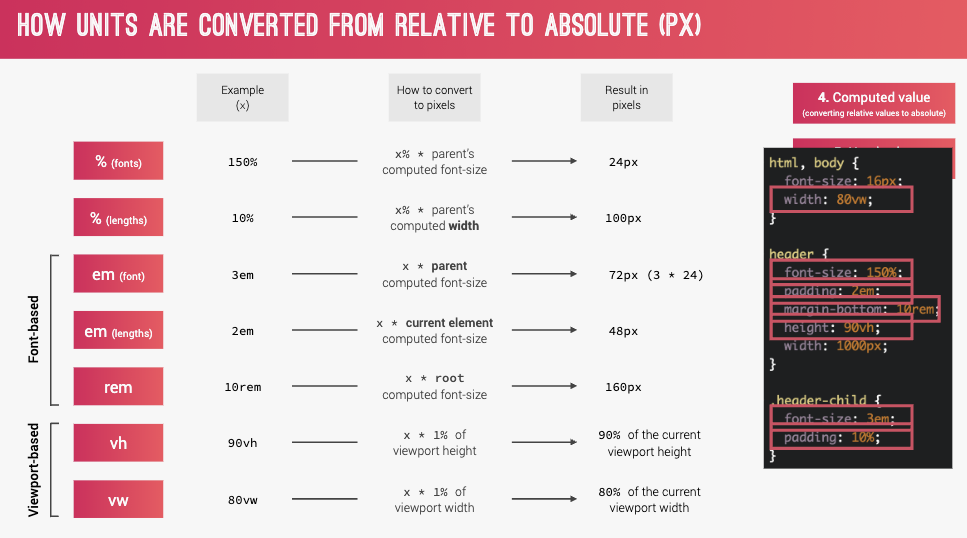

## 1、构建一个网站需要哪些步骤？

1. **Define**：定义这个网站项目

   👉 `业务目标`：搞清楚这个网站给谁用，使用这个网站的用户是谁？是自己？还是商业客户？

   👉 `用户目标`：明白这个网站是做什么的，用户使用这个网站的主要目标是什么？是提供信息吗？还是卖一些产品？或者是娱乐网站？

   👉 `明确的目标受众`：定义网站的目标受众画像，你的网站用户画像越明确，就越可能取得成功！

2. **Plan**：规划网站项目

   👉 `资源整理`：计划并收集网站内容资源（文本、图像、视频等等）。

   👉 `站点地图`：对于大型网站，应该规划网站站点地图：网站都需要哪些页面，这些页面如何相互关联？

   👉 `内容为主`：基于内容，规划页面的每一部分都在向用户传达什么信息？

   👉 `个性化`：如果需要，定义网站个性化的风格。

3. **Sketch**：布局设计

   👉 `组件布局`：思考需要什么组件、布局？（**一切都是为了传达信息所服务**）

   👉 `画草图`：使用笔 🖊️ 将自己脑中的构想画出来。（或者使用类似`Figma`这样的设计软件）这是一个**迭代的过程**，所以不要想着一步到位，尽可能尝试不同的组件与布局以达到自己喜欢的设计。

4. **Design and Build**：设计并构建这个网站项目

   👉 `在浏览器中设计`：使用`HTML`和`CSS`将上面步骤中的构想实现在浏览器中。遵循良好的网站设计指南（空白、颜色、图标等等）。

5. **Test and Optimize**：测试并优化

   👉 `浏览器支持`：尽可能确保主流浏览器（`Chrome`、`Firefox`、`Edge`）都能够支持你的网站。

   👉 `响应式`：移动设备是否也能够很好的查看你的网站呢？修复细节。

   👉 `测试网站性能`：使用谷歌浏览器检查模式中的`Lighthouse`工具查看网站性能。

   👉 `SEO ：思考如何让搜索引擎更好的识别到你的网站。`

6. **Lunch**：运行发布

   👉 `发布共享`：确保你的网站一切运转良好之后，就可以将它发布在互联网上供客户查看使用了。

7. **Maintain and Update**：维护并更新

   👉 `维护更新`：维护更新你的网站，使其能够持续性发展。

### 1.1、响应式设计

响应式设计（`Responsive Design`）保证你所创造的网站能够根据用户不同的设备在不同尺寸的屏幕上能够流畅运行，它绝对是现在网页设计的标准。其包含**Fuild Layout**、**Media queries**、**Flexible Image**、**Correct Unit**、**Desktop-first vs mobile-first**等基本概念。

- **Fuild Layout**：流畅的布局

  👉 流畅的布局使得网页能够很好的适应当前的浏览器窗口宽度（乃至高度）。为了做到这一点，请使用`%`或者`vh`、`vw`，而不是`px`这样的单位。另外请使用`max-width`而不是`width`这样的属性。请保证对[Float 布局](https://developer.mozilla.org/zh-CN/docs/Web/CSS/float)、[Flexbox 布局](https://developer.mozilla.org/zh-CN/docs/Learn/CSS/CSS_layout/Flexbox)以及[Grid 布局](https://developer.mozilla.org/zh-CN/docs/Web/CSS/grid)有一定的熟悉程度。

- **Correct Unit**：正确的单位

  👉 正确的长度单位应该是`rem`而不是`px`。这将让我们更容易对页面所有元素的大小进行缩放。

- **Flexible Image**：灵活的图片

  👉 默认情况下，图片并不会像文本那样能够随着浏览器视窗大小的变化自动缩放，因此，我们总是使用`%`作为图片尺寸的单位，而不是`px`。另外某些情况下会更偏向于使用`max-width`而不是`width`属性。

- **Media queries**：媒体查询

  👉 媒体查询允许我们依据不同的`breakpoint`改变 CSS 样式，从而在不同的浏览器视窗宽度上呈现不同的效果。

### 1.2、可维护、可扩展的代码

如果你要你的网站具有更高的扩展性，更容易维护，就意味着你需要编写**干净、易于理解、健壮**的代码，除此以外更重要的是你需要考虑**如何组织你的文件、如何命名代码中的类名、如何在 HTML 中构建标记**等等。

### 1.3、提高网站的性能

提高网站性能意味着你的网站能够让用户请求下载更少的数据并且能够运行的更快。你可以通过**让用户发送更少的 HTTP 请求、尽可能使你的代码更简洁、压缩代码、使用像`SaaS`这样的预处理器、使用更少的图片、压缩图表**等方式使你的网站具有更快的访问速度。

::: warning 📢 在构建我们的项目时，我们要时常问自己

**“我们正在编写的代码是否是响应式的？是否具有可维护、可扩展的良好特性？是否会降低网站的性能？”**，这是成为一个真正的前端开发人员必须具备的思考。

 :::

## 2、Web背后的事情

当用户在浏览器中输入类似`https://www.google.com/map`（`https`是协议、`www.google.com`是域名、`/map`是请求资源路径）这样的网址以后，浏览器首先会获取域名经过**DNS服务器解析**后的**IP**地址，之后会包装**请求报文**（包括请求行、请求头部、请求数据）发送到**IP**对应的主机，之后便会与该主机建立**TCP/IP**链接，建立链接后，服务器会将**响应报文**（包括状态行、响应头、响应正文等）发送回浏览器解析。以上便是一次HTTP/HTTPS的请求响应过程。

## 3、Front-End和Back-End的区别

前端通常是面向用户的，经典的`HTML`、`CSS`、`JavaScript`是前端开发的基础技术，现在的前端产生了非常多的提高效率的工具，例如`Vue`、`React`等框架。

后端通常对用户是不可见的，后端代码通常运行在Web服务器中，后端技术栈包含非常多的内容，典型的例如：`springBoot`等Java开发框架、`Flask`等Python开发框架都是基础开发工具，另外后端还需要和数据库连接，例如`MySQL`、`mongoDB`等等。

## 4、静态网站和动态网站的区别

所谓**静态网站**指的是服务器只提供文件（例如HTML、CSS、Img、Javascript代码）给浏览器，之后浏览器完成对这些文件的加载渲染。

而**动态网站**指得是服务器需要做更多的工作，例如获取数据库中的数据，通过模版构建网页，最终将网页返回给浏览器进行解析展示。

事实上，现在越来越多的动态网站演变为后端只提供获取数据的`API`，之后在浏览器拿到数据，经过`Vue`、`React`这样的前端框架渲染解析后，最终将网页呈现给用户。以下是基于`API`构建网站的模式和传统动态网站的对比：

事实上，基于API模式确实拥有了更多的可能性，如下所示：

## 5、设计编码架构MVC

`MVC`指的是：`Model`、`View`、`Controller`，有很多方式实现这个架构，但是这里只讨论最简单的架构：模型层关心与应用程序数据有关的一切以及业务逻辑，控制层负责处理应用程序的请求并于模型层交互将响应结果返回给客户端，视图层负责用户界面相关逻辑。使用`MVC`架构，客户端与服务器之间的请求响应的整个过程就可以用下图表示：

### 5.1应用程序逻辑和业务逻辑的区别：

+ 应用程序逻辑只关心和应用程序实现有关的代码逻辑，而不关心具体的业务目标，是视图层和模型层之间的桥梁。
+ 业务逻辑关心的是能够解决业务目标的相关代码，举例来说：在数据库创建一个与业务相关的记录信息，检查用户密码是否正确，验证用户的输入，确保谁购买了相关产品以便能够进行评论等等都属于业务逻辑。

::: tip 开发人员的目标

我们要做的就是将应用程序逻辑和业务逻辑相分离，在`Controller`中做与应用程序逻辑相关的开发，在`Model`中做与业务逻辑相关的工作。尽可能的保证控制器层中有较少的逻辑，将更多的与业务逻辑相关联的工作放在模型层。

:::

### 2.2、CSS 处理值

- CSS 处理值总共有 6 个步骤，如下所示：

  

- CSS 在转换不同单位时的具体做法如下所示：

  

::: info 总结

+ 每一个属性如果没有被声明值，它都有一个默认值（没有继承的情况下）。
+ 浏览器默认页面`root font-size`值为**16px**。
+ 如果使用`%`作为`font-size`的单位，就表示其是相对于**父元素的`font-size`属性**而言的。
+ 如果使用`%`作为`长度`单位（例如 width、padding），就表示其是相对于**父元素的`width`属性**而言的。
+ 如果使用`em`作为`font-size`的单位，就表示其是相对于**父元素的`font-size`属性**而言的。
+ 如果使用`em`作为长度单位（例如 width、padding），就表示其是相对于**本元素的`font-size`属性**而言的。
+ `rem`始终表示相对于**根元素的`font-size`属性**。
+ `vh`和`vw`始终表示相对于**浏览器视窗的`height`和`width`属性**而言的。

:::

- CSS 继承允许开发人员编写更少的代码，并使代码具有更高的维护性。
  - 通常来说有关于**文本的属性都是可继承**的，例如`font-family`、`font-size`、`color`等等。而`margin`、`padding`这样的边距属性是不可继承的。
  - 继承的值是计算过后的值，而不是开发人员原始声明的值，这意味着`font-size: 10%`这样的原始声明值会被转换为**具体的像素值**被应用在子元素身上。
  - 我们可以使用`inherit`关键字实现强制继承。同样地，也可以使用`initial`关键字将属性值设定为初始值。

### 2.3、Visual Formatting Model 是怎么工作的？

- CSS 视觉格式化（`Visual Formatting Model`）模型是一个计算渲染树中的每一个元素盒子并确定这些盒子在页面上该如何布局的算法。所包含的内容有：[盒模型](https://developer.mozilla.org/zh-CN/docs/Learn/CSS/Building_blocks/The_box_model)、[定位方案](https://developer.mozilla.org/zh-CN/docs/Web/CSS/position)、[堆叠上下文](https://developer.mozilla.org/zh-CN/docs/Web/CSS/CSS_positioned_layout/Understanding_z-index/Stacking_context)等等。

## 3、Sass 是什么？

- Sass 是一个 CSS 预处理器，能够为最基本的 CSS 提供很多增强功能。当然 CSS 预处理器有很多，例如`Less`、`Stylus`等等，但`Sass`是目前最受欢迎的 CSS 预处理器。

> 那么 Saas 提供了哪些增强呢？

👉**变量**：Sass 提供了类似于编程语言一般的变量，这可以让开发人员更好的复用颜色、字体大小、间距等等。通过`$variable_name: variable_value;`的方式定义变量，通过`$variable_name`的方式使用变量。

👉**嵌套**：我们可以在一个选择器中嵌套另一个选择器，这能够让开发人员编写更少的代码。在嵌套代码块中写`&`表示引用当前选择器。

👉**运算符**：运算符可用于对 CSS 数据进行数学运算，例如加减乘除等等。

👉**mixin**：`mixin`可以让开发人员能够复用一段 CSS 代码块，而不是像变量那样只能复用具体的一个值。使用`@mixin mixin_name{}`声明可复用的代码块，使用`@include mixin_name`使用声明过的可复用代码块。另外`mixin`还支持使用变量进行**传参**。

👉**function**：`fuction`让开发人员能够自定义函数，实现自己的可复用逻辑代码。使用`@function func_name(parm1, parm2, ...) { ... @return ...}`定义函数，通过`func_name(parm1, parm2, ...)`使用函数。

👉**extend**：`extend`具有与`mixin`相同的功能，都能够实现代码片段复用的功能，但是与`mixin`不同的是，`extend`复用的代码块在编译之后，会优化代码，使得重复代码变少。而`mixin`只是简单的将代码片段复制在使用的地方，而不会进行优化。通过`%extend_name {}`声明可复用代码片段，通过`@extend %extend_name;`使用声明的可复用代码片段。

👉 **架构**：除了以上的基本功能以外，`scss`还提供了更好的组织 css 代码的方式。通过`@import ""`导入其他文件。
