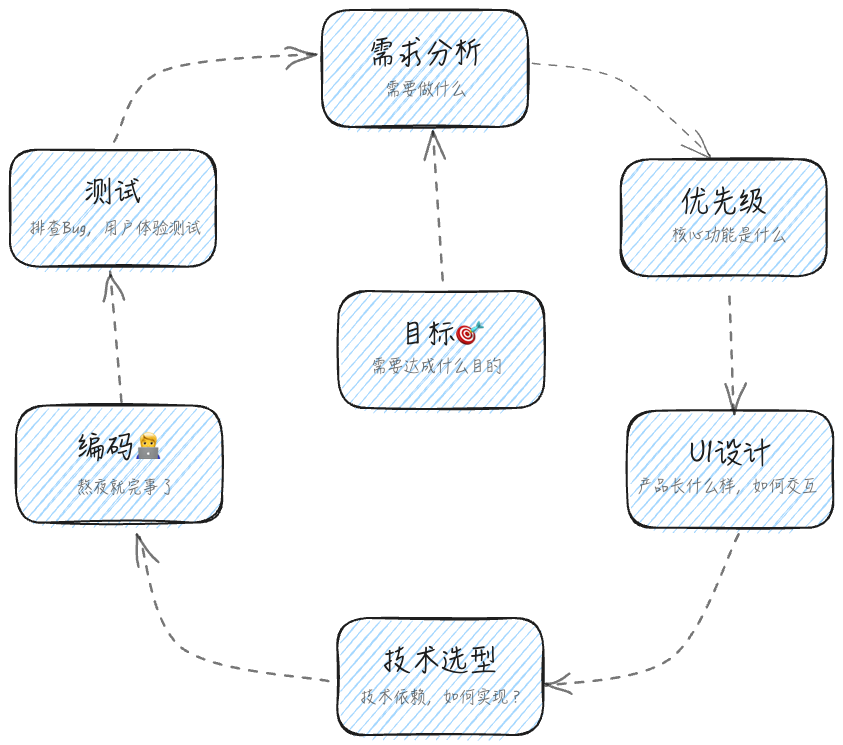
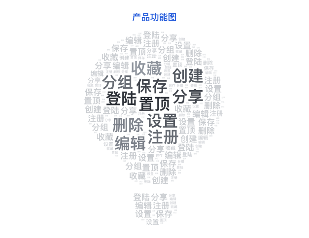
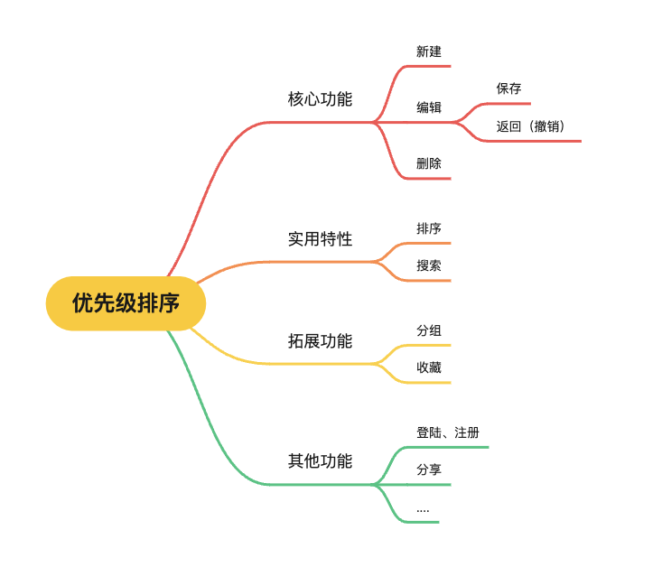

# 自学鸿蒙开发一个月能做出什么样的APP?

## 快速开发的核心理念

>快速开发是指一种以最小幅度的规划并迅速完成产品原型的方法论。

### 如何把脑海中的一个点子💡**快速**地变成一个真正的产品呢？

首先介绍一个简单的概念：`MVP(Minimum Viable Product)`，即**最小可行性产品**。该理念最早是由Eric Ries在其著作《精益创业》中提出。

和传统理念不同的是，MVP强调以最小成本验证你的产品在真正的商业市场上是否具有可行性。举个简单的例子，如果你希望做一个读书APP，而作为产品原型的MVP只需要包含最核心的功能即可，也许就是一个呈现书本基本信息的卡片以及书本内容的展示。

借助这一理念，可以快速实现脑海中想法的落地，在一次次实践中，最终完成产品正式版的发布。

### 如何构建一个MVP呢？

以一个APP为例，其大致的开发流程可能如下：

+ **明确产品目标**：能够为用户提供的价值
+ **确定需求范围**：帮助用户实现目标的需要具备的功能
+ **核心功能抽取**：对功能进行优先级排序，列出最基本的功能
+ **UI设计**：产品长什么样？与用户的交互等
+ **技术选型**：实现的技术方案，技术依赖等
+ **编码实现**：做一个技术工人吧👷

+ **测试**：用户体验测试，排查Bug等

经过上述流程的一次次迭代，产品的最终形态也将会在一次次的反馈中逐步完善。

## 构建自己的APP：InspireNote

+ 明确产品**目标**：提供一个便捷、高效的方式来**捕捉**和**管理**临时的**创意**、**想法**和**信息**。

+ **需求分析**：

  

+ **功能优先级分析**：依据**使用频率、必要程度**等等对产品功能进行分级

  

+ **UI设计**：

  

  

  
  
  
  