## 背景介绍

**鸿蒙开发**所使用的主要语言是华为自研的`ArkTS`开发语言，这是基于`TypeScript`的一门具有**声明式 UI**、**状态管理**等特性的编程语言，这使得使用`ArkTS`具有开发效率高、开发体验好等优点。


### Hello ArkTS 示例

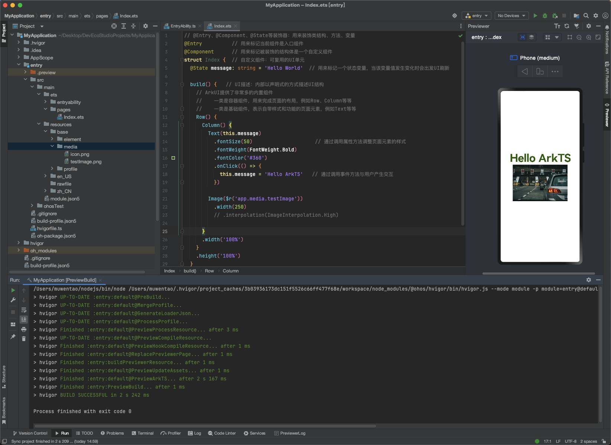

### 工程级目录结构解析

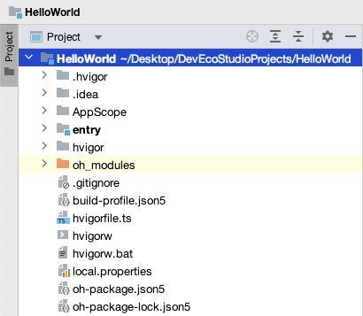

其中详细如下：

- `AppScope`中存放应用全局所需要的资源文件。
- `entry`是应用的主模块，存放HarmonyOS应用的代码、资源等。
- `oh_modules`是工程的依赖包，存放工程依赖的源文件。
- `build-profile.json5`是工程级配置信息，包括签名、产品配置等。
- `hvigorfile.ts`是工程级编译构建任务脚本，`hvigor`是基于任务管理机制实现的一款全新的自动化构建工具，主要提供任务注册编排，工程模型管理、配置管理等核心能力。
- `oh-package.json5`是工程级依赖配置文件，用于记录引入包的配置信息。

在`AppScope`，其中有`resources`文件夹和工程级配置文件`app.json5`。`AppScope>resources>base`中包含`element`和`media`两个文件夹，

- 其中`element`文件夹主要存放公共的字符串、布局文件等资源。
- `media`存放全局公共的多媒体资源文件。

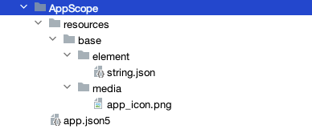

### 模块级目录结构解析

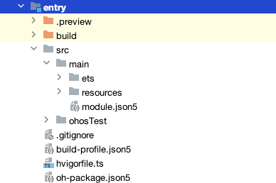

`entry>src`目录中主要包含总的`main`文件夹，单元测试目录`ohosTest`，以及**模块级的配置文件**。

- `main`文件夹中，`ets文件夹`用于存放ets代码，`resources文件夹`存放模块内的多媒体及布局文件等，`module.json5`文件为模块的配置文件。
- `build-profile.json5`是模块级配置信息，包括编译构建配置项。
- `hvigorfile.ts`文件是模块级构建脚本。
- `oh-package.json5`是模块级依赖配置信息文件。

进入`src>main>ets`目录中，其分为`entryability`、`pages`两个文件夹。

- `entryability`存放`ability`文件，用于**当前ability**应用逻辑和生命周期管理。
- `pages`存放UI界面相关代码文件，初始会生成一个Index页面。

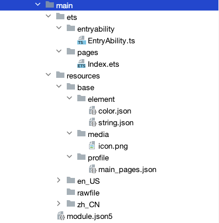

+ `resources`目录下存放模块公共的多媒体、字符串及布局文件等资源，分别存放在`element`、`media`文件夹中。`en_US`和`zh_CN`是国际化配置相关资源存放目录。

### 几个重要的配置文件

#### app.json5

`AppScope>app.json5`是应用的全局的配置文件，用于存放应用公共的配置信息。

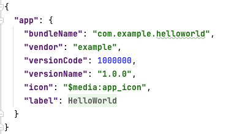

其中配置信息如下：

- `bundleName`是包名。
- `vendor`是应用程序供应商。
- `versionCode`是用于区分应用版本。
- `versionName`是版本号。
- `icon`对应于应用的显示图标。
- `label`是应用名。

#### modulu.json5

`entry>src>main>module.json5`是模块的配置文件，包含当前模块的配置信息。

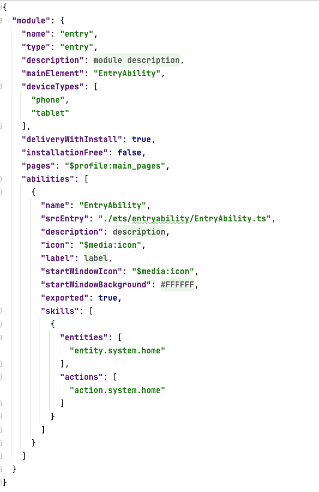

其中`module`对应的是模块的配置信息，一个模块对应一个打包后的`hap`包，hap包全称是**HarmonyOS Ability Package**，其中包含了**ability**、**第三方库**、**资源和配置文件**。其具体属性及其描述可以参照下表。

|        属性         |                             描述                             |
| :-----------------: | :----------------------------------------------------------: |
|        name         | 该标签标识当前module的名字，module打包成hap后，表示hap的名称，标签值采用字符串表示（最大长度`31`个字节），该名称在整个应用要**唯一**。 |
|        type         | 表示模块的类型，类型有三种，分别是`entry`、`feature`和`har`。 |
|      srcEntry       |                   当前模块的入口文件路径。                   |
|     description     |                     当前模块的描述信息。                     |
|     mainElement     | 该标签标识hap的**入口ability名称**或者**extension名称**。只有配置为mainElement的ability或者extension才允许在服务中心露出。 |
|     deviceTypes     | 该标签标识hap可以运行在哪类设备上，标签值采用字符串数组的表示。 |
| deliveryWithInstall | 标识当前Module是否在用户主动安装的时候安装，表示该Module对应的HAP是否跟随应用一起安装。`true`：主动安装时安装。`false`：主动安装时不安装。 |
|  installationFree   | 标识当前Module是否支持免安装特性。`true`：表示支持免安装特性，且符合免安装约束。`false`：表示不支持免安装特性。 |
|        pages        | 对应的是`main_pages.json`文件，用于配置ability中用到的page信息。 |
|      abilities      | 是一个**数组**，存放当前模块中**所有的ability元能力**的配置信息，其中可以有多个ability。 |

对于`abilities`中每一个ability的属性项，其描述信息如下表。

|         属性          |                             描述                             |
| :-------------------: | :----------------------------------------------------------: |
|         name          | 该标签标识当前ability的逻辑名，该名称**在整个应用要唯一**，标签值采用字符串表示（最大长度`127`个字节）。 |
|       srcEntry        |                   ability的入口代码路径。                    |
|      description      |                     ability的描述信息。                      |
|         icon          | ability的图标。该标签标识ability图标，标签值为资源文件的索引。该标签可缺省，缺省值为空。如果ability被配置为MainElement，该标签必须配置。 |
|         label         |                      ability的标签名。                       |
|    startWindowIcon    |                       启动页面的图标。                       |
| startWindowBackground |                      启动页面的背景色。                      |
|        visible        | ability是否可以被其他应用程序调用，`true`表示可以被其它应用调用， `false`表示不可以被其它应用调用。 |
|        skills         | 标识能够接收的意图的action值的集合，取值通常为系统预定义的action值，也允许自定义。 |
|       entities        |              标识能够接收Want的Entity值的集合。              |
|        actions        | 标识能够接收的Want的Action值的集合，取值通常为系统预定义的action值，也允许自定义。 |

#### main_page.json5

`src/main/resources/base/profile/main_pages.json`文件保存的是页面page的路径配置信息，所有需要进行路由跳转的page页面都要在这里进行配置。

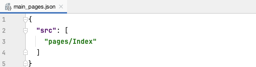

## ArkUI

`ArkUI`是用于构建分布式应用界面的**声明式**UI开发框架，包含丰富的UI组件以及实时界面预览工具，使用一套`ArkTS`API就可以开发能够多设备部署的工程项目。

### 基本概念

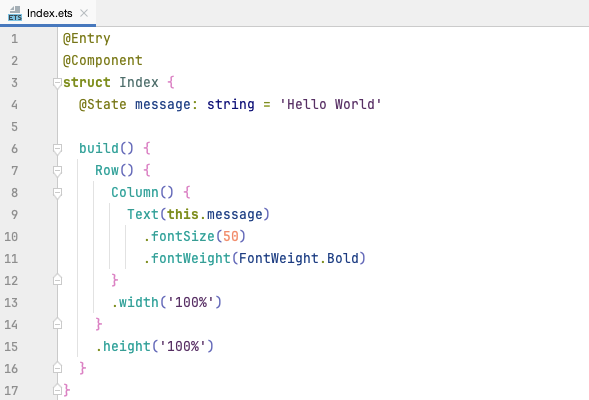

+ **装饰器**：用于装饰类、结构、方法和变量的标记，赋予其特殊含义。如
  + `@Entry`表示页面的默认入口组件。当页面被加载时，将首先创建并呈现被`@Entry`修饰的组件。
  + `@Component`表示自定义组件，自定义组件是一个可重用的结构代码块，用于和ArkUI提供的丰富内置组件相区别；需要结合`struct`关键字表示该代码块具有组件化能力，在自定义组件中必须包含`build`函数。
  + `@State`表示状态变量，被`@State`标记的变量发生改变时，视图UI会自动更新以重新渲染该变量的值到视图中。

+ **UI描述**：是指在`build`方法代码块中以声明式的方式描述UI结构。

+ **内置组件**：ArkUI提供的基础组件（如`Text`等）和容器组件（如`Row`、`Column`等）。
+ **属性方法**：是指设置组件属性的方法。如`fontSize`、`fontWeight`等等。
+ **事件方法**：是指设置组件对不同事件相应逻辑的方法。如`onChange`、`onClick`等等。

### 自定义组件声明周期

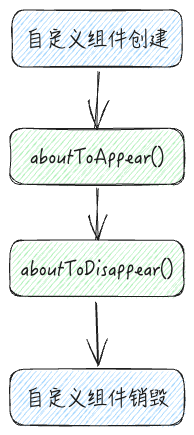


自定义组件声明周期是指自定义组件从创建到销毁的过程。ArkUI提供了两个生命周期函数（系统自动调用，无法手动调用）：

+ `aboutToAppear()`函数在自定义组件创建结束之后以及其`build`函数执行之前执行，可以在该函数中对UI中需要展示的数据进行初始化或者申请定时器资源等操作。
+ `aboutToDisappear()`函数在自定义组件销毁时调用，可以在该函数中释放不再使用的资源，避免资源泄漏。

对于页面入口组件，`ArkUI`还提供了另外3个生命周期函数：

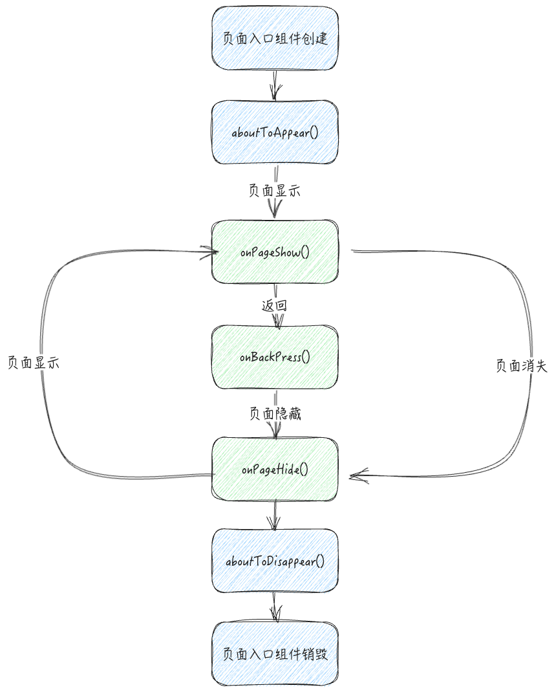

+ `onPageShow()`：当页面进入前台显示时触发。
+ `onBackPress()`：当用户点击返回按钮通过系统方式执行返回操作时触发。当该函数返回`true`时，表示页面自己处理返回逻辑，不进行页面返回。当该函数返回`false`时，表示由系统处理返回逻辑，默认为`false`。
+ `onPageHide()`：当页面进入后台消失时触发。

### 条件渲染、循环渲染的语法


### 状态管理

#### @State装饰器

在声明式UI中，**状态**能够驱动**视图**进行自动更新。


状态（State）：指驱动视图更新的数据（被装饰器修饰的变量）。

视图（View）：基于UI描述渲染得到的用户界面。

视图依赖状态变量，当状态变量发生变化时，视图会自动渲染更新，使用新的状态变量丰富页面。这种机制就是**状态管理**。

::: tip 使用`@State`需要注意的几点

+ `@State`装饰器修饰的变量必须初始化，不能为空值。
+ `@State`装饰器支持的数据类型是有限的，其仅支持`Object`、`class`、`string`、`number`、`boolean`、`enum`类型及这些类型的**数组**。如`any`、`union`等复杂的数据类型`@State`装饰器并不支持。
+ 嵌套类型以及修改数组中的对象属性是无法触发视图更新的。而在数组中添加、删除元素或者改变对象引用时可以触发视图更新。

:::

#### @Prop、@Link装饰器

`@Prop`装饰器、`@Link`装饰器可以实现父子组件之间的数据同步。 

在子组件中通过`@Prop`装饰器修饰变量，可以实现父组件`@State`状态变量的**单向同步**，即父组件中修改会影响子组件，子组件不会影响父组件。

在子组件中通过`@Link`装饰器修饰变量，可以实现父组件`@State`状态变量的**双向同步**，即父组件和自组件同时共享一份数据，任何一方所做的修改都会反映给另一方。

::: tip 注意

+ 使用`@Prop`和`@Link`这两个装饰器修饰的变量不能初始化。
+ `@Prop`装饰器只支持`string`、`number`、`boolean`、`enum`类型，如果父组件的状态变量是一个对象，子组件可以接受对象属性，但`@Prop`不能修饰数组、`any`等类型。
+ 使用`@Link`装饰器，父组件向子组件传值时必须传递**引用**，即必须使用`$`作为变量前缀。
+ `@Link`装饰器要求父子组件的类型必须一致，支持`string`、`number`、`boolean`、`enum`、`object`、`class`以及他们的数组。嵌套类型以及修改数组中的对象属性是无法触发视图更新的。而在数组中添加、删除元素或者改变对象引用时可以触发视图更新。和`@State`装饰器保持一致，区别就是`@Link`用在子组件中。

:::

`@Provide`和`@Consume`可以**跨组件**提供类似于`@State`和`@Link`的双向同步。这意味着父组件和孙子组件可以共享同一份数据。并且父组件不需要传递状态变量给子组件了，这意味着代码书写量会减少，但同时会带来一定损耗，因此推荐能用`@Prop`和`@Link`解决就用这两者解决。

如果子组件使用父组件的数据，但不做修改就使用`@Prop`装饰器。如果子组件使用父组件的数据并做修改就使用`@Link`装饰器。

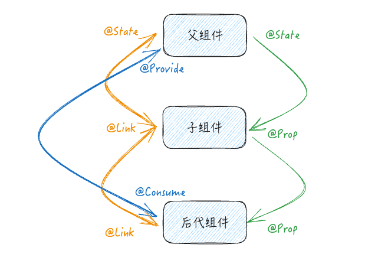

#### @Observed、@ObjectLink装饰器

`@Observed`、`@ObjectLink`装饰器用于在**嵌套对象**或**数组元素为对象**的场景中进行双向数据同步。

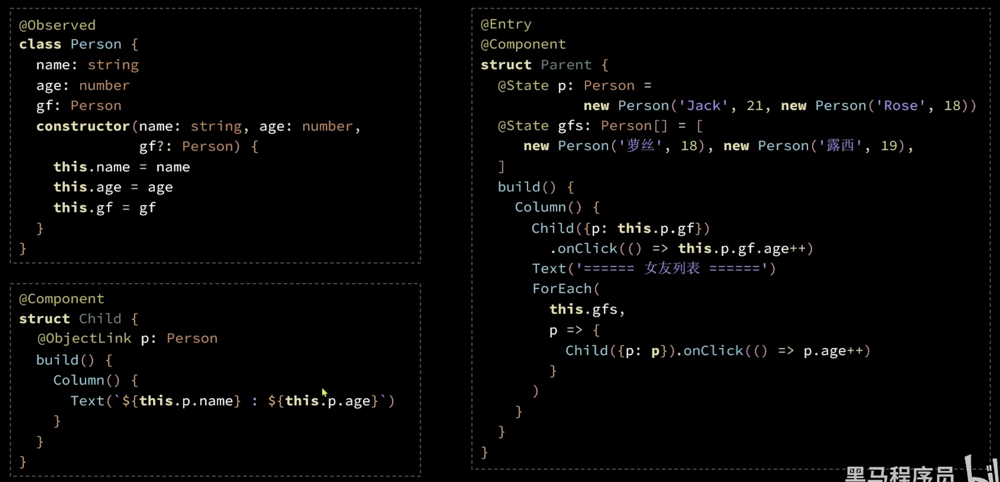

### 应用程序框架

#### UIAbility基本概念

`UIAbility`是一种包含用户界面的应用组件，主要用于和用户进行交互。通常用户可以通过以下方式进入`UIAbility`：

+ 点击桌面应用图标进入应用。
+ 一个应用拉起另外一个应用，例如在图库应用中通过分享进入备忘录应用。
+ 从最近任务列表中切回应用。

每一个`UIAbility`都对应于最近任务列表中的一个任务，`UIAbility`作为系统调度的单元，提供窗口用于界面绘制。一个应用可以有一个`UIAbility`，也可以有多个`UIAbility`，建议将一个独立的功能模块放在同一个`UIAbility`中。一个`UIAbility`可以对应多个页面，多个页面之间可以通过页面路由进行跳转。

#### UIAbility内的页面跳转

[页面路由](https://developer.harmonyos.com/cn/docs/documentation/doc-references-V3/js-apis-router-0000001478061893-V3?catalogVersion=V3)具体是指在应用程序中不同页面之间的跳转和数据传递实现。

页面使用栈结构实现显示和返回等等。HarmonyOS页面栈的最大容量上限为**32**个页面，使用`router.clear()`方法可以清空页面栈所有历史页面，释放内存，仅保留当前页面作为栈顶页面。

`Router`有两种页面跳转模式：

+ `router.pushUrl()`：目标页不会替换当前页，而是压入页面栈。因此可以使用`router.back()`返回当前页面，在调用router.back()方法之前，可以先调用`router.enableBackPageAlert()`方法开启页面返回询问对话框功能。关闭页面返回询问对话框功能，可以通过调用`router.disableAlertBeforeBackPage()`方法关闭该功能即可。

  ```ts
  router.enableBackPageAlert({
    message: 'Message Info'
  });
  
  router.back();
  ```

+ `router.replaceUrl()`：目标页替换当前页面，当前页会被销毁并释放资源，因此无法返回。

`Router`的两种页面示例模式：

+ `Standard`：标准实例模式，每次跳转都会新建一个目标页并压入栈顶，默认就是这种模式。
+ `Single`：单实例模式，如果目标页已经在栈中，则离栈顶最近的同Url页面会被移动到栈顶并重新加载。

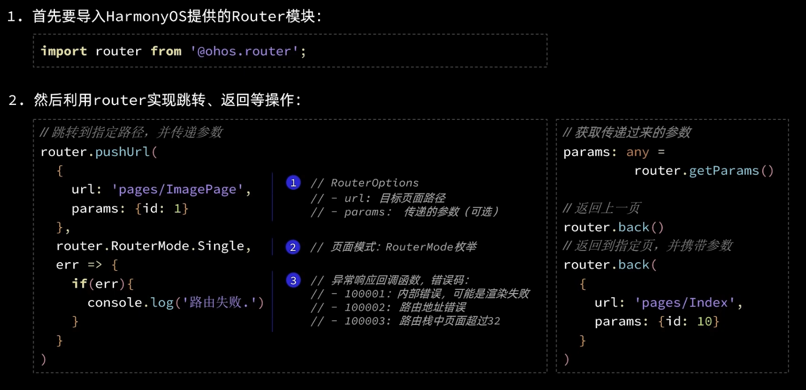

#### UIAbility的生命周期

当用户打开、切换和退出应用时，应用中的UIAbility实例会在其生命周期的不同状态之间进行转换。`UIAbility`包含`Create`、`Foreground`、`Background`、`Destroy`四个状态。`WindowStageCreate`和`WindowStageDestroy`是UIAbility中管理UI界面功能的两个生命周期回调函数。

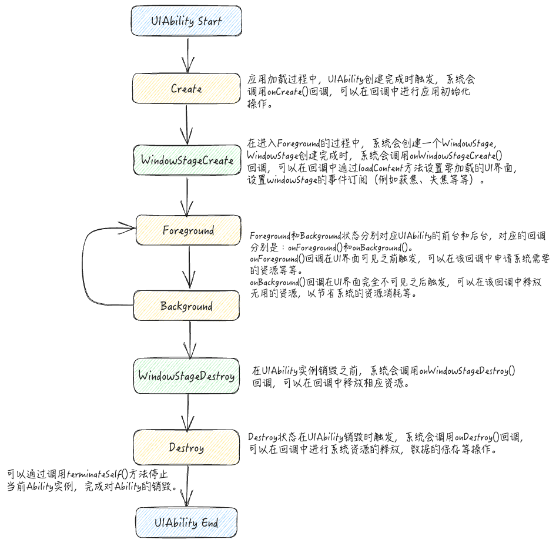

#### UIAbility的启动模式

**UIAbility**当前支持`singleton`（单实例模式）、`multiton`（多实例模式）和`specified`（指定实例模式）3种启动模式。启动模式的开发使用，配置`module.json5`文件中的“**launchType**”字段即可。

- **singleton（单实例模式）**：是默认情况下的启动模式。每次调用`startAbility()`方法时，如果应用进程中该类型的UIAbility实例已经存在，则复用系统中的UIAbility实例。系统中只存在唯一一个该UIAbility实例，即在最近任务列表中只存在一个该类型的UIAbility实例。
- **multiton（多实例模式）**：每次调用`startAbility()`方法时，都会在应用进程中**创建一个新的**该类型UIAbility实例。即在最近任务列表中可以看到有多个该类型的UIAbility实例。这种情况下可以将UIAbility配置为multiton（多实例模式）。
- **specified（指定实例模式）**：针对一些特殊场景使用（例如文档应用中每次新建文档希望都能新建一个文档实例，重复打开一个已保存的文档希望打开的都是同一个文档实例）。[参考文档](https://developer.huawei.com/consumer/cn/training/course/slightMooc/C101667310940295021)


### 基本内置组件

#### Image：图片显示组件

- 声明`Image`组件并设置图片源：`Image(src: string|PixelMap|Resource)`

  - `string`格式，通常用来加载网络图片：`Image('https://xxx.png')`。加载网络图片需要申请网络访问权限：`ohos.permission.INTERNET`
  - `PixelMap`格式，可以加载像素图，通常用在图片编辑中：`Image(pixelMapObject)`
  - `Resource`格式，通常用来加载本地图片，是最常用的加载图片的方式：
    - `Image($r('app.media.mate60'))`：加载*resources/base/media/mate60.png*图片；**可以省略后缀名**。
    - `Image($rawfile('mate60.png'))`：加载*resources/rawfile/mate60.png*图片；**不可以省略后缀名**。

- 通过给图片添加属性设置图片组件样式，例如：

  ```ts
  Image($r("app.media.icon"))
    .width(100) // 宽度
    .height(120) // 高度
    .borderRadius(10) // 圆角边框
    .interpolation(ImageInterpolation.High); // 图片插值
  ```

#### Text：文字组件

- 声明`Text`组件并设置文本内容：`Text(content?: string|Resource)`

  - `string`格式，直接填写文本内容：`Text('Hello World')`
  - `Resource`格式，读取本地限定词目录下的`element/string.json`文件：`Text($r('app.string.text_label'))`；

- 添加文本组件属性示例：

  ```ts
  Text("注册")
    .lineHeight(32) // 行高
    .fontSize(20) // 字体大小
    .fontColor("#ff1876f8") // 字体颜色
    .fontWeight(FontWeight.Medium); // 字体粗细
  ```

#### TextInput：输入框组件

- 声明`TextInput`组件：`TextInput({placeholder?: ResourceStr, text?: ResourceStr})`

  - `ResourceStr`：表示接受字符串或 Resource 格式输入。
  - `placeholder`：输入框无输入时的提示文本
  - `text`：输入框当前的文本内容

- 添加文本输入框组件的属性方法示例：

  ```ts
  TextInput({ text: "当前文本内容" })
    .width(150) // 宽度
    .height(30) // 高度
    .backgroundColor("FFF") // 背景色
    .type(InputType.Password) // 输入框类型
    .onChange((value) => {
      // value表示用户输入的文本内容
    });
  
  /* 输入框类型：
  			Normal: 基本输入模式，支持输入数字、字母、下划线、空格、特殊字符。
  			Password：密码输入模式，支持输入数字、字母、下划线、空格、特殊字符。
  			Email：邮箱地址输入模式，支持数字、字母、下划线以及@字符。
  			Number：纯数字输入模式。
  			PhoneNumber：电话号码输入模式，支持输入数字、+、-、*、#，长度不限。
  */
  ```

#### Button：按钮组件

- 声明`Button`组件并设置`label`：`Button(label?: ResourceStr)`

  - 文字型按钮：`Button("点击")`

  - 自定义按钮：

    ```ts
    Button(){
      Image($r('app.media.search'))
      	.width(20)
        .margin(10)
    }
    ```

- 添加属性和事件方法示例：

  ```ts
  Button("Click")
    .width(100)
    .height(30)
    .type(ButtonType.Normal) // 按钮类型
    .onClick(() => {
      // 处理点击事件
    });
  
  /* 按钮类型：
      Capsule：胶囊型按钮（圆角默认为高度的一半）
      Circle：圆形按钮
      Normal：普通按钮（默认不带圆角）
  
  */
  ```

#### Slider：滑动条组件

- 声明滑动条组件：`Slider(options?: SliderOptions)`

  ```ts
  Slider({
    min: 0, // 最小值
    max: 100, // 最大值
    value: 30, // 当前值
    step: 10, // 滑动步长
    style: SliderStyle.OutSet, // OutSet是默认值，InSet表示滑块在滑动条的里面
    direction: Axis.Horizontal, // Horizaontal是默认值，Vertical表示竖直方向
    reverse: false, // 是否反向滑动（调换最小值及最大值的方向）
  })
    .width("90%")
    .showTips(true) // 是否显示value百分比提示
    .blockColor("#360") // 滑块的颜色
    .onChange((value) => {
      // value是当前滑块值
    });
  ```

#### Row、Column：布局组件

- `Row`、`Column`组件主要用做页面的布局，这两个组件都有其相应的**主轴**和**交叉轴**，其中`Row`是按照水平排列的方式进行布局的，主轴是水平方向，交叉轴是垂直方向。`Column`是按照竖直排列的方式进行布局，主轴是垂直方向，交叉轴是水平方向。

- 这两个组件都可以使用`justifyContent`属性方法设置沿**主轴**方向的对齐方式，参数是`FlexAlign`枚举。

  - Column 容器的主轴对齐方式：

  - Row 容器的主轴对齐方式：

- 使用`alignItems`属性方法设置两个组件沿**交叉轴**的对齐方式，其中`Row`容器参数使用`VerticalAlign`枚举，而`Column`容器使用`HorizontalAlign`枚举。

  - 两种容器的交叉轴对齐方式：

- 在声明两种组件时，可以同时传入`space`选项控制组件中页面元素的间距。

#### List：列表组件

- `List`是一种复杂的容器组件，具有以下特点：
  - 列表项`ListItem`数量过多超出屏幕以后，会自动提供滚动功能。
  - 列表项`ListItem`既可以纵向排列，也可以横向排列

```ts
List( {space: 8 }) {
  ForEach(
  	this.items,
    (items: Item) => {
      ListItem() {
        // ListItem内部只支持一个根组件
       	...
      }
    }
  )
}
.width('100%')
.height("100%")   // 列表组件一定要设置高度，
.layoutWeight(1)  // layoutWeight这是布局所占权重，其他是0，所以除其他以外占用剩余空间
```

#### Blank：空白组件

- `Blank`组件可以简单的实现某些布局效果，其作用是占用剩余的所有空间。

### 抽取公共代码

- 可以使用`export/import`的方式导入导出自定义组件，实现组件的复用。组件可以定义成员变量，使用时传入相应的值即可。
- 还可以使用`@Builder`装饰器创建自定义构建函数（可以传参），实现抽取公共代码的功能，使页面整体代码结构更加有组织。如果是全局构建函数要在`@Builder`装饰器后加`function`关键字。

- `@Styles`装饰器可以创建自定义公共样式。 如果是全局的公共样式要在`@Styles`装饰器后加`function`关键字。另外自定义公共样式里只能包含公共的样式。

- 某些组件特有的样式代码也可以被提取，使用`@Extend`装饰器即可，

  ```ts
  @Extend(Text) function priceText() {
  	.fontColor("#360")
    .fontSize(18)
  }
  ```

  

  


### 动画

#### [属性动画](https://developer.huawei.com/consumer/cn/doc/harmonyos-references-V2/ts-animatorproperty-0000001478181445-V2)

当组件的某些通用属性发生变化时，通过设置组件的`animation`属性自动实现组件的渐变过渡效果。支持的属性有：`width`、`height`、`backgroundColor`、`opacity`、`scale`、`rotate`、`translate`等等。想要组件随某个属性值的变化而产生动画，此属性需要加在`animation`属性之前。有的属性变化不希望通过`animation`产生属性动画，可以放在`animation`之后。

#### [显示动画](https://developer.huawei.com/consumer/cn/doc/harmonyos-references-V2/ts-explicit-animation-0000001478341181-V2)

显示动画通过全局`animateTo`函数修改组件属性，实现属性变化时的渐变过渡效果。其需要把执行动画的属性的修改放在闭包函数中出发动画。这种方式更为灵活。

#### [组件转场动画](https://developer.huawei.com/consumer/cn/doc/harmonyos-references-V2/ts-transition-animation-component-0000001427902496-V2)

组件转场动画是在组件插入或移除时的过渡动画，通过组件的`transition`属性配置转场参数。组件转场动画需要结合`animateTo`函数一起使用。

### 应用模型：Stage模型

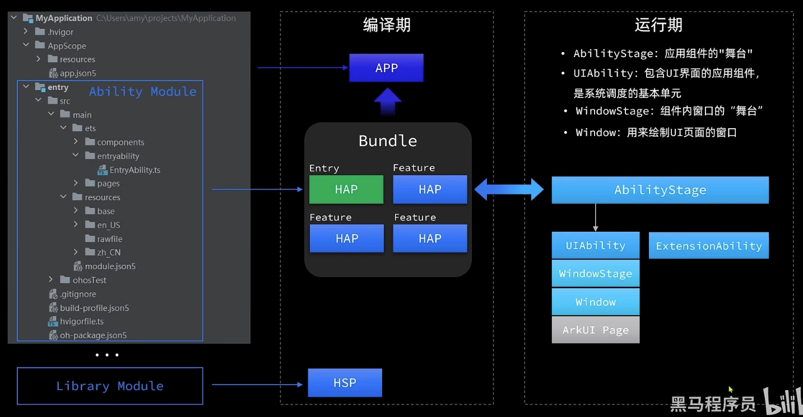


 

 


