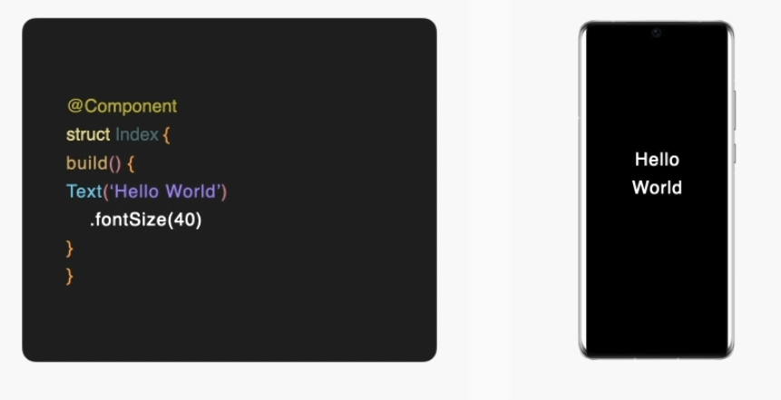
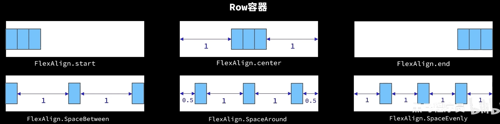
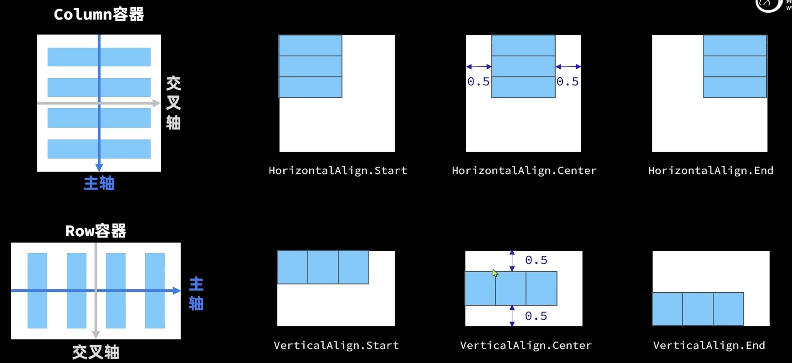
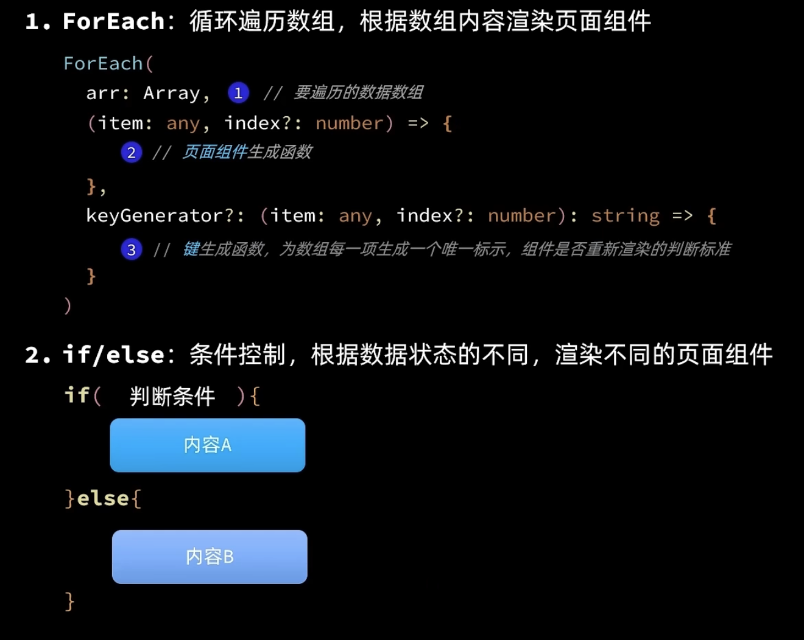
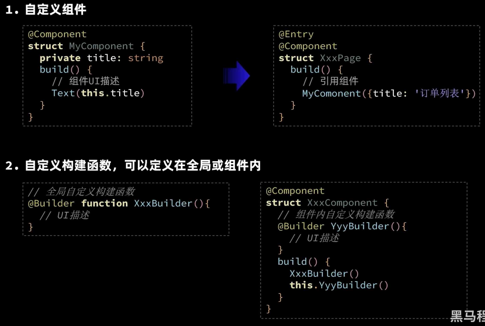
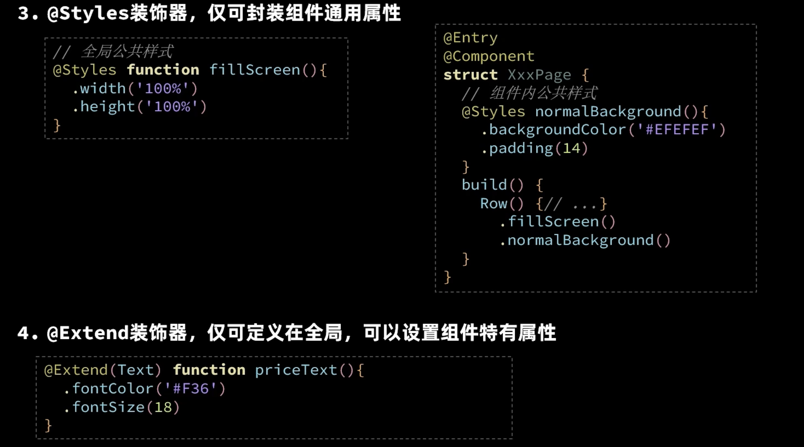

## 背景介绍

+ [鸿蒙官网](https://www.harmonyos.com/)
+ [华为开发者官网](https://developer.huawei.com/consumer/cn/)

**鸿蒙开发**主要是开发移动端应用程序的，其所使用的主要语言是`ArkTS`，这是基于`TypeScript`的一门具有**声明式UI**、**状态管理**等特性的编程语言，这使得使用`ArkTS`具有开发效率高、开发体验好等优点。



### 基础示例


## ArkUI组件

### Image：图片显示组件

+ 声明`Image`组件并设置图片源：`Image(src: string|PixelMap|Resource)`
  + `string`格式，通常用来加载网络图片：`Image('https://xxx.png')`。加载网络图片需要申请网络访问权限：`ohos.permission.INTERNET`
  + `PixelMap`格式，可以加载像素图，通常用在图片编辑中：`Image(pixelMapObject)`
  + `Resource`格式，通常用来加载本地图片，是最常用的加载图片的方式：
    + `Image($r('app.media.mate60'))`：加载*resources/base/media/mate60.png*图片；**可以省略后缀名**。
    + `Image($rawfile('mate60.png'))`：加载*resources/rawfile/mate60.png*图片；**不可以省略后缀名**。

+ 通过给图片添加属性设置图片组件样式，例如：

  ```ts
  Image($r('app.media.icon'))
  	.width(100)				// 宽度
  	.height(120)			// 高度
  	.borderRadius(10)		// 圆角边框
  	.interpolation(ImageInterpolation.High)		// 图片插值
  ```

### Text：文字组件

+ 声明`Text`组件并设置文本内容：`Text(content?: string|Resource)`
  + `string`格式，直接填写文本内容：`Text('Hello World')`
  + `Resource`格式，读取本地限定词目录下的`element/string.json`文件：`Text($r('app.string.text_label'))`；

+ 添加文本组件属性示例：

  ```ts
  Text("注册")
  	.lineHeight(32)				// 行高
  	.fontSize(20)				// 字体大小
  	.fontColor('#ff1876f8')		// 字体颜色
  	.fontWeight(FontWeight.Medium)	// 字体粗细
  ```

### TextInput：输入框组件

+ 声明`TextInput`组件：`TextInput({placeholder?: ResourceStr, text?: ResourceStr})`
  + `ResourceStr`：表示接受字符串或Resource格式输入。
  + `placeholder`：输入框无输入时的提示文本
  + `text`：输入框当前的文本内容

+ 添加文本输入框组件的属性方法示例：

  ```ts
  TextInput({text: '当前文本内容'})
  	.width(150)				// 宽度
  	.height(30)				// 高度
  	.backgroundColor('FFF')			// 背景色
  	.type(InputType.Password)		// 输入框类型
  	.onChange(value => {
    	// value表示用户输入的文本内容
  	})
  
  /* 输入框类型：
  			Normal: 基本输入模式，支持输入数字、字母、下划线、空格、特殊字符。
  			Password：密码输入模式，支持输入数字、字母、下划线、空格、特殊字符。
  			Email：邮箱地址输入模式，支持数字、字母、下划线以及@字符。
  			Number：纯数字输入模式。
  			PhoneNumber：电话号码输入模式，支持输入数字、+、-、*、#，长度不限。
  */
  ```

### Button：按钮组件

+ 声明`Button`组件并设置`label`：`Button(label?: ResourceStr)`

  + 文字型按钮：`Button("点击")`

  + 自定义按钮：

    ```ts
    Button(){ 
      Image($r('app.media.search'))
      	.width(20)
        .margin(10)
    }
    ```

+ 添加属性和事件方法示例：

  ```ts
  Button('Click')
    .width(100)		
    .height(30)
    .type(ButtonType.Normal)		// 按钮类型
    .onClick(() => {				
      // 处理点击事件
    })
  
  /* 按钮类型：
      Capsule：胶囊型按钮（圆角默认为高度的一半）
      Circle：圆形按钮
      Normal：普通按钮（默认不带圆角）
  
  */
  ```

### Slider：滑动条组件

+ 声明滑动条组件：`Slider(options?: SliderOptions)`

  ```ts
  Slider({
    min: 0,			// 最小值
    max: 100,			// 最大值
    value: 30,		// 当前值
    step: 10,			// 滑动步长
    style: SliderStyle.OutSet,		// OutSet是默认值，InSet表示滑块在滑动条的里面
    direction: Axis.Horizontal,		// Horizaontal是默认值，Vertical表示竖直方向
    reverse: false					// 是否反向滑动（调换最小值及最大值的方向）
  })
  	.width('90%')
  	.showTips(true)				// 是否显示value百分比提示
  	.blockColor("#360")			// 滑块的颜色
  	.onChange(value => {
    	// value是当前滑块值
  	})
  ```

### Row、Column：布局组件

+ `Row`、`Column`组件主要用做页面的布局，这两个组件都有其相应的**主轴**和**交叉轴**，其中`Row`是按照水平排列的方式进行布局的，主轴是水平方向，交叉轴是垂直方向。`Column`是按照竖直排列的方式进行布局，主轴是垂直方向，交叉轴是水平方向。

+ 这两个组件都可以使用`justifyContent`属性方法设置沿**主轴**方向的对齐方式，参数是`FlexAlign`枚举。

  + Column容器的主轴对齐方式：

  + Row容器的主轴对齐方式：

+ 使用`alignItems`属性方法设置两个组件沿**交叉轴**的对齐方式，其中`Row`容器参数使用`VerticalAlign`枚举，而`Column`容器使用`HorizontalAlign`枚举。
  + 两种容器的交叉轴对齐方式：

+ 在声明两种组件时，可以同时传入`space`选项控制组件中页面元素的间距。

### 循环渲染语法



### List：列表组件

+ `List`是一种复杂的容器组件，具有以下特点：
  + 列表项`ListItem`数量过多超出屏幕以后，会自动提供滚动功能。
  + 列表项`ListItem`既可以纵向排列，也可以横向排列

```ts
List( {space: 8 }) {
  ForEach(
  	this.items,
    (items: Item) => {
      ListItem() {
        // ListItem内部只支持一个根组件
       	...
      }
    }
  )
}
.width('100%')
```

### Blank：空白组件

+ `Blank`组件可以简单的实现某些布局效果，其作用是占用剩余的所有空间。

### 抽取公共代码

+ 可以使用`export/import`的方式导入导出自定义组件，实现组件的复用。组件可以定义成员变量，使用时传入相应的值即可。
+ 还可以使用`@Builder`装饰器创建自定义构建函数（可以传参），实现抽取公共代码的功能，使页面整体代码结构更加有组织。如果是全局构建函数要在`@Builder`装饰器后加`function`关键字。

+ `@Style`装饰器可以创建自定义公共样式。 如果是全局的公共样式要在`@Style`装饰器后加`function`关键字。另外自定义公共样式里只能包含公共的样式。

+ 某些组件特有的样式代码也可以被提取，使用`@Extend`装饰器即可，

  ```ts
  @Extend(Text) function priceText() {
  	.fontColor("#360")
    .fontSize(18)
  }
  ```

  

  

## 状态管理

