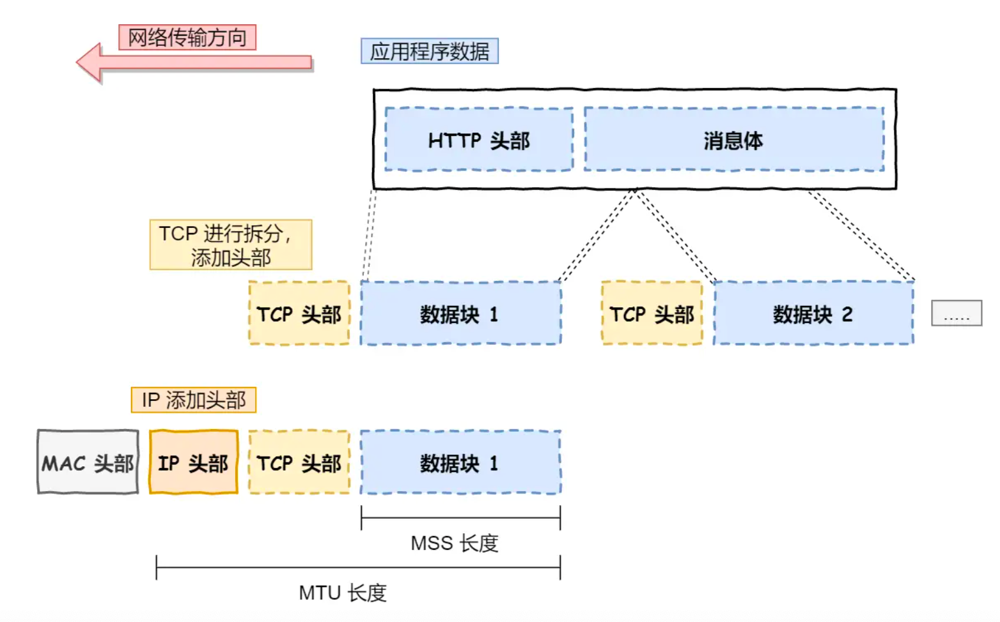

# 介绍一下TCP/IP模型和OSI模型的区别
## OSI模型
::: details 👉点我查看答案
OSI模型，全称是“开放系统互连”模型，它是国际标准化组织（ISO）制定的一个用于计算机或通信系统间互联的标准体系，也就是说它是一个抽象的理论模型，它将计算机网络通信划分为七个不同的层级，从物理层到应用层，每个层级都有其特定的功能。下方的层级为上方的层级提供服务。
七个层级分别是：物理层、数据链路层、网络层、传输层、会话层、表示层、应用层。
1. 其中物理层主要负责原始比特流在物理介质上的传输，包括对硬件设备和传输介质之间接口规范的定义。
2. 数据链路层负责“数据帧”的封装与解析，包括错误检测和流量控制。
3. 网络层负责路由选择和地址解析，IP协议就位于该层中。
4. 传输层主要负责数据端到端的传输，确保数据的完整性和准确性，TCP、UDP协议都属于该层。
5. 会话层主要管理应用程序之间的会话，负责会话的创建和销毁。
6. 表示层负责数据表示形式的转化，包括压缩和解密等等。
7. 应用层为应用程序提供接口，处理用户请求和响应，包括HTTP、FTP、DNS等协议。
::: 

::: tip 扩展阅读
OSI模型主要体现的是理论上的全面性👍，它主要用作网络分层架构的设计，但在实际网络通信中，通常使用的是TCP/IP协议簇，它是OSI模型的简化版本，同样包括UDP、TCP等等协议。
:::

## TCP/IP模型
::: details 👉点我查看答案
TCP/IP模型将七层网络架构简化为为四个层级，分别是网络接口层、网络层、传输层、应用层。
1. 其中应用层合并了OSI模型的应用层、表示层以及会话层，主要为用户提供直接与应用程序交互的接口。该层为网络上的各种应用程序提供服务，比如电子邮件使用该层中的SMTP协议、网页数据传输使用HTTP协议、文件传输使用FTP协议等等。
2. 应用层的数据包会向下传递给传输层，该层主要有两个比较知名的协议：TCP和UDP。其中TCP全称“传输控制协议”，它提供可靠的数据传输，能够保证数据的完整性，大部分应用都是基于TCP协议的。而UDP只负责发送数据包，不负责确认数据包是否抵达到接收方，适用于不要求可靠性的传输，并且UDP实时性相对TCP而言要更好一些，所以比较适合音视频流的传输。当要传输的数据过大，该层就会将数据进行分段传输。另外传输层在向应用层传递数据时，报文中通常都需要携带操作系统为这些进程分配的端口号，以此来确认该报文的接收方。
   
3. 网络层负责数据包的路由和转发，最常使用的是IP协议，他将传输层的报文作为数据部分再加上IP包头组成IP报文进行发送，通过网络号（负责标识一个IP地址属于哪个子网）和主机号（负责标识同一子网下的不同主机）对具体设备进行寻址。网络号和主机号可以通过IP地址与子网掩码进行按位与获得。除了寻址以外，IP协议还有一个重要的能力是“路由”，寻址更像是导航，路由则是依据具体的路由算法进行选择数据包的具体传输路径。
4. 最后的网络接口层对应OSI模型的数据链路层和物理层。该层在IP报文前方加上mac头，从而在以太网中实现数据的传递转发，该层还提供错误检测和纠正的功能。
:::
