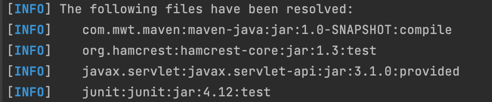
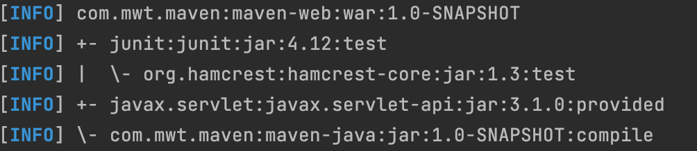
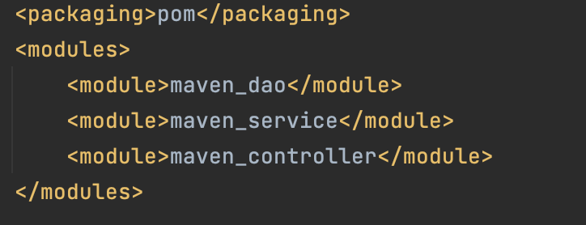
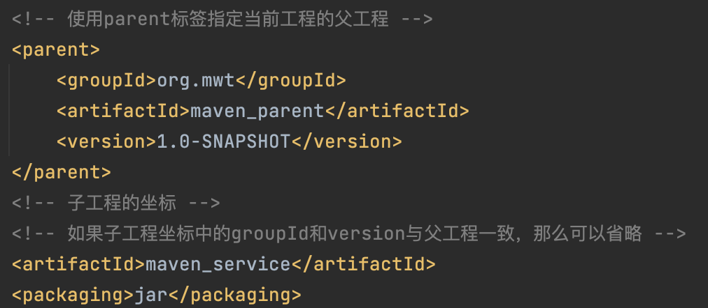

## 前置知识
- Java 基础
- JavaWeb 相关知识(Servlet、Jsp等)


## 1 为什么要学习 Maven？

### 1.1 Maven 作为`依赖管理工具`

1. **解决项目所需 jar 包规模越来越大的问题**：当我们使用封装程度很高的框架时，项目的一个模块中用到的 jar 包是非常多的，可能只用到框架中的三个不同功能，就需要导入100多个 jar 包。使用 Maven 可以很大程度地简化导入 jar 包依赖的过程。

2. **无需关心 jar 包的来源**：使用 Maven 可以实现对依赖的 jar 包自动下载，无需自己去网络上找 jar 包。

3. **自动解决 jar 包之间的依赖关系**：使用 Maven 可以自动的解析 jar 包之间的依赖关系。

### 1.2 Maven作为`构建管理工具`

- 构建过程：
    

### 1.3 结论

- `管理规模庞大的 jar 包`，需要专门工具。
- `脱离 IDE 环境执行构建操作（服务端构建）`，需要专门工具。

## 2 Maven是什么？

Maven 是 Apache 软件基金会组织维护的一个专门为 Java 项目提供`构建`和`依赖`管理支持的工具。

- [Maven官网](https://maven.apache.org/index.html)
- [下载页面](https://maven.apache.org/download.cgi)

### 2.1 构建管理

构建指的是：使用`原材料`生产`产品`的过程。Java 项目中，原材料指的是：`Java 源代码、图片、配置文件等等`。产品指的是：`可以在服务器运行的项目`。

构建过程包含的主要环节有：
- **清理**：删除上一次构建的结果，为下一次构建做好准备。
- **编译**：将 Java 源程序编译成`.class`字节码文件。
- **测试**：运行提前准备好的测试程序。Maven 默认使用`junit`进行测试，并且会针对测试结果生成一个全面的**报告**信息。
- **打包**：
    - Java 工程：`jar包`
    - Web 工程：`war包`
- **安装**：把一个 Maven 工程经过打包操作生成的 jar 包或 war 包存入到 Maven 本地仓库中，方便其他项目引用。
- **部署**：将准备好的 jar 包或 war 包部署到服务器运行。
    - `部署 jar 包`：通常是把一个 jar 包部署到Nexus私服服务器上。
    - `部署 war 包`：通常是借助相关 Maven 插件，将 war 包部署到 Tomcat 服务器上。

### 2.2 依赖管理

依赖管理主要解决以下的问题：
- jar 包的下载：使用Maven后，jar包会从规范的远程仓库下载到本地。
- jar 包之间的依赖：通过依赖的传递性自动解决。
- jar 包之间的冲突：通过对依赖的配置进行调整，使得产生冲突的jar包不会被导入。


### 2.3 Maven工作机制


## 3 配置Maven核心程序
在解压目录中，`conf/setting.xml`是Maven的核心配置文件。

### 3.1 配置本地仓库地址

- 默认目录：
    ```xml
    <!-- localRepository
    | The path to the local repository maven will use to store artifacts.
    |
    | Default: ${user.home}/.m2/repository  // 默认地址
    <localRepository>/path/to/local/repo</localRepository>
    -->
    ```
    修改只需要将`<localRepository>`标签拿出来配置好即可。

### 3.2 配置阿里云镜像地址

Maven 下载 jar 包是访问境外的中央仓库，所以下载速度会很慢，要想提高下载速度，就需要配置镜像地址。
1. 注释掉默认的配置：
    ```xml
    <mirror>
      <id>maven-default-http-blocker</id>
      <mirrorOf>external:http:*</mirrorOf>
      <name>Pseudo repository to mirror external repositories initially using HTTP.</name>
      <url>http://0.0.0.0/</url>
      <blocked>true</blocked>
    </mirror>
    ```

2. 修改为自己的配置：
    ```xml
    <mirror>
        <id>aliyunmaven</id>
        <mirrorOf>*</mirrorOf>
        <name>阿里云公共仓库</name>
        <url>https://maven.aliyun.com/repository/public</url>
    </mirror>
    ```

### 3.3 配置Maven工程的基础 JDK 版本

默认配置是使用1.5版本的 JDK ，而通常都使用的是 JDK1.8。所以将以下配置复制到`profiles`标签内。
```xml
<profile>
    <id>jdk-1.8</id>
    <activation>
        <activeByDefault>true</activeByDefault>
        <jdk>1.8</jdk>
    </activation>
    <properties>
        <maven.compiler.source>1.8</maven.compiler.source>
        <maven.compiler.target>1.8</maven.compiler.target>
        <maven.compiler.compilerVersion>1.8</maven.compiler.compilerVersion>
    </properties>
</profile>
```

## 4 创建Maven工程

### 4.1 Maven核心概念：`坐标`

类似于在三维空间中唯一定位一个点需要使用三个坐标点，Maven 也使用三个坐标**唯一定位**`Maven仓库`中的一个 `jar` 包。这三个坐标分别是：
- `groupId`：公司或组织的 id，一般取值为公司或组织域名的倒序，通常还会加上项目名称。
    - 如：`org.apache.maven`

- `artifactID`：一个项目或者是项目中一个模块的 id，一般取值为模块的名称，后面会作为打包Maven工程的工程名的一部分。

- `Version`：模块的版本号
    - `SNAPSHOT`：表示快照版本，正在迭代过程中，不稳定的版本。
    - `RELEASE`：表示正式版本


### 4.2 坐标和 Maven 本地仓库中 jar 包存储路径之间的对应关系举例

- 坐标：
    ```xml
    <groupId>javax.servlet</groupId>
    <artifactId>servlet-api</artifactId>
    <version>2.5</version>
    ```
- 在本地仓库中所对应存储路径：
    ```text
    Maven本地仓库目录/javax/servlet/servlet-api/2.5/servlet-api-2.5.jar
    ```

### 4.3 Maven工程核心概念：POM

- 含义：`Project Object Model，项目对象模型`。与类似的DOM（Document Object Model，文档对象模型）都是模型化思想的具体体现。

- 具体思想：将工程抽象为一个模型，再用程序中的对象描述这个模型，实现通过程序管理项目工程。

- 对应的核心配置文件：`pom.xml`


### 4.4 Maven工程约定的目录结构

- 各个目录结构的含义作用
    
    另外专门用于存放构建输出结果的目录是`target`。

- 约定目录结构的意义：为了使构建过程尽可能`自动化`地完成。

- 开发领域的技术发展趋势：`配置大于编码，约定大于配置`。


### 4.5 实验操作

#### 4.5.1 创建普通 Java 工程

1. 创建工程
    
    
    ```shell
    $ mvn archetype:generate  # 命令
    # 结果
    ....    
    Downloaded from central: https://repo.maven.apache.org/maven2/org/apache/maven/archetypes/maven-archetype-quickstart/1.0/maven-archetype-quickstart-1.0.jar (4.3 kB at 26 kB/s)
    Define value for property 'groupId': com.mwt.maven
    Define value for property 'artifactId': maven-java
    Define value for property 'version' 1.0-SNAPSHOT: :
    Define value for property 'package' com.mwt.maven: :
    Confirm properties configuration:
    groupId: com.mwt.maven      # 输入groupId
    artifactId: maven-java      # 输入artifactId   
    version: 1.0-SNAPSHOT       # 输入版本信息（默认即可）
    package: com.mwt.maven      # 输入包信息（默认即可）
    Y: : y     # y表示同意创建
    [INFO] ----------------------------------------------------------------------------
    [INFO] Using following parameters for creating project from Old (1.x) Archetype: maven-archetype-quickstart:1.0
    [INFO] ----------------------------------------------------------------------------
    [INFO] Parameter: basedir, Value: /Users/muwentao/Desktop/CodeField/MavenSpace/SpaceVedio
    [INFO] Parameter: package, Value: com.mwt.maven
    [INFO] Parameter: groupId, Value: com.mwt.maven
    [INFO] Parameter: artifactId, Value: maven-java
    [INFO] Parameter: packageName, Value: com.mwt.maven
    [INFO] Parameter: version, Value: 1.0-SNAPSHOT
    [INFO] project created from Old (1.x) Archetype in dir: /Users/muwentao/Desktop/CodeField/MavenSpace/SpaceVedio/maven-java
    [INFO] ------------------------------------------------------------------------
    [INFO] BUILD SUCCESS    # 构建成功
    [INFO] ------------------------------------------------------------------------
    [INFO] Total time:  04:40 min
    [INFO] Finished at: 2023-04-12T16:09:43+08:00
    [INFO] ------------------------------------------------------------------------
    ```
    
2. 调整
    Maven 默认生成的工程，对 `junit` 依赖的是较低的 3.8.1 版本，通常会改为更合适的 4.12 的版本。

    另外自动生成的 App.java 和 AppTest.java 不需要也可以删除掉。

    **解读`pom.xml`文件**：
    ```xml
    <!-- 根标签：project，对当前工程的配置、管理信息都放在根标签内 -->
    <project xmlns="http://maven.apache.org/POM/4.0.0" xmlns:xsi="http://www.w3.org/2001/XMLSchema-instance"
    xsi:schemaLocation="http://maven.apache.org/POM/4.0.0 http://maven.apache.org/maven-v4_0_0.xsd">
    
        <!-- 从Maven2开始就固定为4.0.0，代表当前pom.xml所采用的标签结构，一般不会发生大的变动 -->
        <modelVersion>4.0.0</modelVersion>
    
        <!-- 项目工程坐标信息 -->
        <groupId>com.mwt.maven</groupId>
        <artifactId>maven-java</artifactId>
        <version>1.0-SNAPSHOT</version>
    
        <!-- 打包方式，jar 包（表示 Java 工程），还可以取值为 war（表示 web 工程）、pom（表示用来管理其他工程的工程）-->
        <packaging>jar</packaging>
        
        <name>maven-java</name>
        <url>http://maven.apache.org</url>
    
        <!-- 依赖信息配置，可以包含多个dependency标签 -->
        <dependencies>
    
            <!-- 创建一个具体的依赖 -->
            <dependency>
    
                <!-- 通过坐标依赖其他jar包 -->
                <groupId>junit</groupId>
                <artifactId>junit</artifactId>
                <version>4.12</version>
    
                <!-- 表示依赖生效范围 -->
                <scope>test</scope>
            
            </dependency>
        </dependencies>
    </project>
    ```

3. 在 Maven 工程中写代码

    - 主体程序（被测试的程序）写在主体程序目录存放Java源代码的目录`src/main/java`中。
        ```java
        package com.mwt.maven;
    
        public class Calculator {
    
            public int sum(int i, int j){
                return i + j;
            }
        }
        ```

    - 测试程序存放位置同理，写在`src/test/java`中。
        ```java
        package com.mwt.maven;
    
        import org.junit.Test;
    
        // 静态导入的效果是将Assert类中的静态资源导入当前类
        // 这样一来，在当前类中就可以直接使用Assert类中的静态资源，不需要写类名
        // 比如后面的 assertEquals() 方法
        import static org.junit.Assert.*;
    
        public class CalculatorTest {
    
            // junit 4.x版本才可以使用注解的方式
            @Test
            public void testSum(){
    
                // 1.创建Calculator对象
                Calculator calculator = new Calculator();
    
                // 2.调用Calculator对象的方法，获取到程序运行实际的结果
                int actualResult = calculator.sum(5, 3);
    
                // 3.声明一个变量，表示程序运行期待的结果
                int expectedResult = 8;
    
                // 4.使用断言来判断实际结果和期待结果是否一致
                // 如果一致：测试通过，不会抛出异常
                // 如果不一致：抛出异常，测试失败
                assertEquals(expectedResult, actualResult);
    
                // 为了证明测试过程执行了本程序，添加一行输出代码
                System.out.println("Test method have been called !");
    
            }
        }
        ```

4. 执行Maven相关命令

    - **要求**：运行Maven中和构建操作相关的命令时，必须进入到`pom.xml`所在的目录中。

    - **清理**：`mvn clean`。效果：删除`target`目录。

    - **编译**：
        - 对主程序编译：`mvn compile`。编译结果存放在：`target/classes`。
        - 对测试程序编译：`mvn test-compile`。编译结果存放在：`target/test-classes`。

    - **测试**：`mvn test`。测试的报告结果存放在`target/surefire-reports`中。

    - **打包**：`mvn package`。结果存放在`target`目录中，测试程序不会包含在里面。名称是由`archefactId`与`Version`组合构成的。

    - **安装**：`mvn install`。效果：将本地构建过程生成的 jar 包存入 Maven 本地仓库中，存放路径是依据坐标生成的，另外安装操作还会将`pom.xml`文件内容一起存入本地仓库中。 


### 4.5.2 创建 JavaWeb 工程


参数 `archetypeGroupId`、`archetypeArtifactId`、`archetypeVersion` 用来指定现在使用的 maven-archetype-webapp 的坐标。

1. 使用命令创建工程

    ```shell
    mvn archetype:generate -DarchetypeGroupId=org.apache.maven.archetypes -DarchetypeArtifactId=maven-archetype-webapp -DarchetypeVersion=1.4
    ```
    这时`pom.xml`中的打包方式就是`war`了。

2. 创建Servlet

    ```java
    package com.mwt.maven;

    import javax.servlet.http.HttpServlet;
    import javax.servlet.http.HttpServletRequest;
    import javax.servlet.http.HttpServletResponse;
    import javax.servlet.ServletException;
    import java.io.IOException;

    public class HelloServlet extends HttpServlet{

        protected void doGet(HttpServletRequest request, HttpServletResponse response) throws ServletException, IOException {

            response.getWriter().write("hello maven web");

        }

    }
    ```

3. 配置Servlet

    ```xml
    <servlet>
        <servlet-name>helloServlet</servlet-name>
        <servlet-class>com.mwt.maven.HelloServlet</servlet-class>
    </servlet>
    <servlet-mapping>
        <servlet-name>helloServlet</servlet-name>
        <url-pattern>/helloServlet</url-pattern>
    </servlet-mapping>
    ```

4. 在`index.jsp`中添加超链接

    ```jsp
    <html>
    <body>
        <h2>Hello World!</h2>
        <a href="helloServlet">Access Servlet</a>
    </body>
    </html>
    ```

5. 手动导入项目所需依赖`servlet-api`：在[Maven Repository](https://mvnrepository.com/)中找到所需依赖，复制粘贴到`pom.xml`中。
    ```xml
    <!-- https://mvnrepository.com/artifact/javax.servlet/javax.servlet-api -->
    <dependency>
      <groupId>javax.servlet</groupId>
      <artifactId>javax.servlet-api</artifactId>
      <version>3.1.0</version>
      <scope>provided</scope>
    </dependency>
    ```

- 之后执行编译、打包部署等过程验证即可。

### 4.5.3 让 Web 工程依赖 Java 工程

1. 在 Web 工程的 `pom.xml`文件的`dependencies`标签中配置所依赖的 Java 工程。

     ```xml
    <!-- 配置对之前自己创建的Java工程的依赖 -->
    <dependency>
        <groupId>com.mwt.maven</groupId>
        <artifactId>maven-java</artifactId>
        <version>1.0-SNAPSHOT</version>
    </dependency>
    ```

2. 在 Web 工程中使用所依赖的 Java 工程

    - 补充创建目录：在 src 下建立`test/java/com/mwt/maven`目录。

    - 确认 Web 工程依赖了`junit`
    
    - 创建测试类：把 Java 工程的 `CalculatorTest.java`类复制到补充创建目录中。

    - 执行 Maven 测试及打包命令进行验证。

3. 查看 Web 

    - 使用`mvn dependency:list`命令列表显示：
    

    - 使用`mvn dependency:tree`命令树形显示：
    


## 5 依赖

### 5.1 依赖范围

- 指定依赖生效范围通过`dependency`标签下的`scope`标签实现。

- `scope`标签可选值：`compile`、`test`、`provided`等等。

    **compile 和 test 对比**：
    |     | main目录（空间）| test目录（空间）| 开发过程（时间）| 部署到服务器（时间）|
    |  ----  | ----  |  ----  | ----  |  ----  |
    | compile  | 有效 | 有效 | 有效 | 有效 |
    | test  | 无效 | 有效 | 有效 | 无效 |

    **compile 和 provided 对比**：
    |     | main目录（空间）| test目录（空间）| 开发过程（时间）| 部署到服务器（时间）|
    |  ----  | ----  |  ----  | ----  |  ----  |
    | compile  | 有效 | 有效 | 有效 | 有效 |
    | provided  | 有效 | 有效 | 有效 | 无效 |

- **结论**：

    - **compile**：通常使用的第三方框架的 jar 包，在项目`实际运行时`要用到的 jar 包都是以 compile 范围进行依赖的。比如 SSM 框架所需jar包。

    - **test**：`测试过程中`使用的 jar 包 test 范围依赖进来。比如 junit。

    - **provided**：在`开发过程中`需要用到的“`服务器上的 jar 包`”通常以 provided 范围依赖进来。比如 servlet-api、jsp-api。而这个范围的 jar 包之所以不参与部署、不放进 war 包，就是**避免和服务器上已有的同类 jar 包产生冲突**，同时减轻服务器的负担。


### 5.2 依赖传递

A 依赖 B，B 依赖 C，那么在 A 没有配置对 C 的依赖的情况下，A 里面能不能直接使用 C？

- **依赖的传递性**：在 A 依赖 B，B 依赖 C 的前提下，C 是否能够传递到 A，取决于 B 依赖 C 时使用的依赖范围。

    - B 依赖 C 时使用 `compile` 范围：可以传递
    - B 依赖 C 时使用 `test` 或 `provided` 范围：不能传递，所以需要这样的 jar 包时，就必须在需要的地方明确配置依赖才可以。


- **依赖传递可能带来的冲突**：

    

解决上面的冲突问题时，需要配置`依赖排除`，就是阻断某些会产生冲突的 jar 包的传递。

- 配置
    ```xml
    <dependency>
        <groupId>com.mwt.maven</groupId>
        <artifactId>maven-java</artifactId>
        <version>1.0-SNAPSHOT</version>
        <scope>compile</scope>
        <!-- 使用excludes标签配置依赖的排除	-->
        <exclusions>
            <!-- 在exclude标签中配置一个具体的排除 -->
            <exclusion>
                <!-- 指定要排除的依赖的坐标（不需要写version） -->
                <groupId>xxxxxx</groupId>
                <artifactId>xxxxxx</artifactId>
            </exclusion>
        </exclusions>
    </dependency>
    ```

## 6 多模块项目（继承与聚合）

### 6.1 继承

- Maven工程之间的继承，A 作为父工程， B 作为子工程，本质上就是 B 工程中`pom.xml`的配置继承了 A 工程的`pom.xml`配置。

- **作用**：在父工程中统一管理项目中的依赖信息，具体来说是管理依赖信息的版本信息。通过在父工程中为整个项目维护依赖信息的组合既保证了整个项目使用规范、准确的 jar 包；又能够将以往的经验沉淀下来，节约时间和精力。

1. 创建多模块项目

    - 父工程`pom.xml`的`packaging`标签的取值为`pom`，并且有完成聚合的`modules`标签配置。
        

    - 子工程`pom.xml`中也有`parent`标签标识父工程。
        

2. 在父工程中统一管理依赖信息
    ```xml
    <!-- 使用dependencyManagement标签配置对依赖的管理 -->
    <!-- 被管理的依赖并没有真正被引入到工程 -->
    <dependencyManagement>
        <dependencies>
            <dependency>
                <groupId>org.springframework</groupId>
                <artifactId>spring-core</artifactId>
                <version>4.0.0.RELEASE</version>
            </dependency>
            <dependency>
                <groupId>org.springframework</groupId>
                <artifactId>spring-beans</artifactId>
                <version>4.0.0.RELEASE</version>
            </dependency>
            <dependency>
                <groupId>org.springframework</groupId>
                <artifactId>spring-context</artifactId>
                <version>4.0.0.RELEASE</version>
            </dependency>
            <dependency>
                <groupId>org.springframework</groupId>
                <artifactId>spring-expression</artifactId>
                <version>4.0.0.RELEASE</version>
            </dependency>
            <dependency>
                <groupId>org.springframework</groupId>
                <artifactId>spring-aop</artifactId>
                <version>4.0.0.RELEASE</version>
            </dependency>
        </dependencies>
    </dependencyManagement>
    ```

3. 在子工程中引用父工程声明的依赖
    ```xml
    <!-- 子工程引用父工程中的依赖信息时，可以把版本号去掉。	-->
    <!-- 把版本号去掉就表示子工程中这个依赖的版本由父工程决定。 -->
    <!-- 具体来说是由父工程的dependencyManagement来决定。 -->
    <!-- 如果要覆盖父工程管理的依赖版本，可以加上version标签-->
    <dependencies>
        <dependency>
            <groupId>org.springframework</groupId>
            <artifactId>spring-core</artifactId>
        </dependency>
        <dependency>
            <groupId>org.springframework</groupId>
            <artifactId>spring-beans</artifactId>
        </dependency>
        <dependency>
            <groupId>org.springframework</groupId>
            <artifactId>spring-context</artifactId>
        </dependency>
        <dependency>
            <groupId>org.springframework</groupId>
            <artifactId>spring-expression</artifactId>
        </dependency>
        <dependency>
            <groupId>org.springframework</groupId>
            <artifactId>spring-aop</artifactId>
        </dependency>
    </dependencies>
    ```
    在父工程里修改配置之后（比如升级版本信息等等），就可以实现`一处修改，处处生效`。

4. 另外还可以在父工程中声明自定义属性标签，然后在需要使用的地方引用自定义的属性名所对应的标签值就可以真正实现**一处修改，处处生效**了。

    - 在父工程中声明
    ```xml
    <properties>
        <maven.compiler.source>18</maven.compiler.source>
        <maven.compiler.target>18</maven.compiler.target>
        <project.build.sourceEncoding>UTF-8</project.build.sourceEncoding>
    
        <!-- 自定义标签，维护Spring版本数据 -->
        <mwt.spring.version>4.3.6.RELEASE</mwt.spring.version>
    </properties>
    ```

    - 在需要使用的地方引用
    ```xml
    <dependency>
        <groupId>org.springframework</groupId>
        <artifactId>spring-core</artifactId>
        <version>${mwt.spring.version}</version>
    </dependency>
    ```

- **实际意义**：提高效率。
    

### 6.2 聚合

- 聚合的配置方式就是在总工程中配置`modules`标签即可。

    

- 聚合的好处：
    - 一键执行Maven命令：在总工程上执行Maven命令会自动按顺序的完成所有工作。
    - 组织结构清晰


## 7 其他核心概念

### 7.1 声明周期

- 作用：提高构建过程的`自动化`程度。

- 三个生命周期：Maven 设定了三个生命周期，生命周期中的每一个环节对应构建过程中的一个操作。

    | 生命周期名称 | 作用解释 | 环节 |
    |  ----  | ----  |  ----  |
    | clean  | 清理相关 | pre-clean <br> clean <br> post-clean |
    | site  | 生成站点相关 | pre-site <br> site <br> post-site <br> deploy-site |
    | default | 主要构建过程 | validate <br> generate-sources <br> process-sources <br> generate-resources <br> process-resources 复制并处理资源文件，至目标目录，准备打包。 <br> compile 编译项目 main 目录下的源代码。<br> process-classes <br> generate-test-sources <br> process-test-sources <br> generate-test-resources <br> process-test-resources 复制并处理资源文件，至目标测试目录。 <br> test-compile 编译测试源代码。 <br> process-test-classes <br> test 使用合适的单元测试框架运行测试。这些测试代码不会被打包或部署。<br> prepare-package <br> package 接受编译好的代码，打包成可发布的格式，如JAR。 <br> pre-integration-test <br> integration-test <br> post-integration-test <br> verify <br> install 将包安装至本地仓库，以让其它项目依赖。 <br> deploy 将最终的包复制到远程的仓库，以让其它开发人员共享；或者部署到服务器上运行（需借助插件，例如：cargo）。

- 特点
    - 这三个生命周期是`彼此独立`的
    - 在任何一个生命周期内部，执行任何一个具体环节的操作，都是从本周期最初的位置开始执行，直到指定的地方。

### 7.2 插件和目标

- 插件：Maven的核心程序仅负责宏观调度，而具体工作都是由Maven插件（就是java程序）完成的。

- 目标：一个插件可以对应多个目标，可以理解为生命周期中具体的环节，对应的是插件的一个一个功能。

### 7.3 仓库

- 本地仓库：自己电脑上存放项目所需 jar 包的目录，通过`settings.xml`文件中的`LocalRepository`标签。

- 远程仓库：
    - 局域网：公司内部搭建的私服服务器（例如借助 Nexus 技术搭建）
    - 因特网：
        - 中央仓库：Maven 官方提供的中央仓库，部署在境外。
        - 镜像仓库：分担中央仓库的负载压力，比如前面配置的阿里云镜像仓库。

**专门搜索依赖信息的仓库地址**：[Maven Repository](https://mvnrepository.com/)